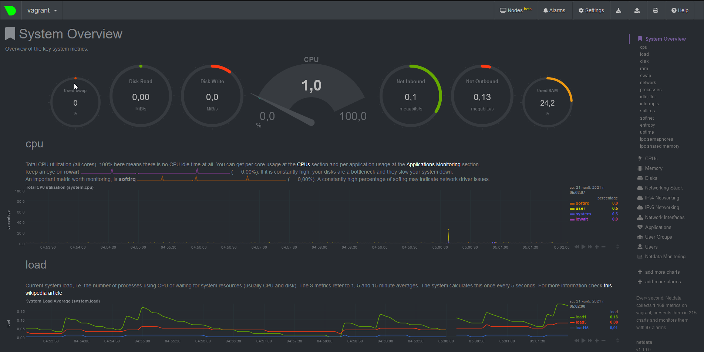

1. Скачали Node Exporter
```
wget https://github.com/prometheus/node_exporter/releases/download/v1.3.0/node_exporter-1.3.0.linux-amd64.tar.gz
tar xvfz node_exporter-1.3.0.linux-amd64.tar.gz
```
Поместили в автозагрузку, создав файл node_exporter.service
```
[Unit]
Description=Node Exporter

[Service]
ExecStart=/opt/node_exporter/node_exporter $OPTIONS

[Install]
WantedBy=multi-user.target
``` 
Удостоверились, что сервис после рестарта ВМ поднялся автоматически и без ошибок.

2. Опций, для базового мониторинга хоста:

CPU:
```
node_cpu_seconds_total{cpu="0",mode="idle"}
node_cpu_seconds_total{cpu="0",mode="iowait"} 
node_cpu_seconds_total{cpu="0",mode="system"}
node_cpu_seconds_total{cpu="0",mode="user"}
node_cpu_seconds_total{cpu="1",mode="idle"}
node_cpu_seconds_total{cpu="1",mode="iowait"}
node_cpu_seconds_total{cpu="1",mode="system"}
node_cpu_seconds_total{cpu="1",mode="user"}
```
Mem:
```
node_memory_SwapFree_bytes
node_memory_MemFree_bytes
node_memory_MemAvailable_bytes
```
Disk:
```
node_disk_io_now{device="*"}
node_disk_io_time_seconds_total{device="*"}
node_disk_read_time_seconds_total{device="*"}
node_disk_write_time_seconds_total{device="*"}
```
Network:
```
node_network_receive_drop_total{device="eth0"}
node_network_receive_errs_total{device="eth0"}
node_network_transmit_drop_total{device="eth0"}
node_network_transmit_errs_total{device="eth0"}
node_network_up{device="eth0"}
```
3. В конфигурационный файл `/etc/netdata/netdata.conf` добавляем секцию `[web]` и параметр `bind to = 0.0.0.0`.
Попробовали также в секции `[global]` в параметре `bind socket to IP` заменить значение **127.0.0.1** на значение **0.0.0.0** - и тоже заработало.
```
# NetData Configuration

# The current full configuration can be retrieved from the running
# server at the URL
#
#   http://localhost:19999/netdata.conf
#
# for example:
#
#   wget -O /etc/netdata/netdata.conf http://localhost:19999/netdata.conf
#

[global]
        run as user = netdata
        web files owner = root
        web files group = root
        # Netdata is not designed to be exposed to potentially hostile
        # networks. See https://github.com/netdata/netdata/issues/164
        bind socket to IP = 127.0.0.

[web]
   bind to = 0.0.0.0
```
Метрики:\


4. Осознает:
```
root@vagrant:/etc/netdata# dmesg | grep virtual
[    0.012282] Booting paravirtualized kernel on VMware hypervisor
[    3.042725] systemd[1]: Detected virtualization vmware.
```
5. Настройка `sysctl`:
```
root@vagrant:/etc/netdata# sysctl fs.nr_open
fs.nr_open = 1048576
```
`nr_open` - Максимальное число открытых дескрипторов файлов.\
Различный вывод команды `ulimit`:
```
root@vagrant:/etc/netdata# ulimit -n
1024
root@vagrant:/etc/netdata# ulimit -Sn
1024
root@vagrant:/etc/netdata# ulimit -Hn
1048576
```
`ulimit -n` -  это максимальное число открытых дескрипторов файлов.\
`ulimit -Sn` - это Soft версия лимит ресурсов.\
`ulimit -Hn` - это Hard версия лимит ресурсов.

6. Выполняем команду `unshare -f -p --mount-proc /bin/bash` и  `sleep 1h &`:
```
root@vagrant:~# ps aux
USER         PID %CPU %MEM    VSZ   RSS TTY      STAT START   TIME COMMAND
root           1  0.0  0.4   7236  4044 pts/0    S    05:39   0:00 /bin/bash
root           8  0.0  0.0   5476   528 pts/0    S    05:39   0:00 sleep 1h
root           9  0.0  0.3   8892  3352 pts/0    R+   05:39   0:00 ps aux
```
Из под 2 терминала видим самый обычный PID:
```
root@vagrant:~# ps aux | grep sleep
root        5160  0.0  0.0   5476   528 pts/0    S    05:39   0:00 sleep 1h
root        5173  0.0  0.0   6432   736 pts/1    S+   05:40   0:00 grep --color=auto sleep
```
Заходим в namespace с другого терминала:
```
root@vagrant:~# nsenter --target 5160 --pid --mount
root@vagrant:/# ps aux
USER         PID %CPU %MEM    VSZ   RSS TTY      STAT START   TIME COMMAND
root           1  0.0  0.4   7236  4044 pts/0    S+   05:39   0:00 /bin/bash
root           8  0.0  0.0   5476   528 pts/0    S    05:39   0:00 sleep 1h
root          10  0.0  0.4   7236  4036 pts/1    S    05:40   0:00 -bash
root          21  0.0  0.3   8892  3392 pts/1    R+   05:40   0:00 ps aux
```
7. `:(){ :|:& };:`  - это форк-бомба, определяет функцию с именем `:` , которая порождает саму себя и создает фон.\
Нам помог механизм `cgroups` (сокращение от control groups, контрольные группы).
```
[ 4412.147344] cgroup: fork rejected by pids controller in /user.slice/user-0.slice/session-11.scope
```
На данный момент `PID_MAX` в нашей ВМ составляет **4194304**. Узнали с помощью команды `cat /proc/sys/kernel/pid_max` или `sysctl kernel.pid_max`\
Установить DefaultTaskMax можно в файле `/etc/systemd/system.conf` таким образом ограничив дополнительно лимит.\
Команда `systemctl show --property DefaultTasksMax` вывела нам значение **DefaultTasksMax=1071**\
Если установить `ulimit -u 100` - число процессов будет ограниченно 100.
