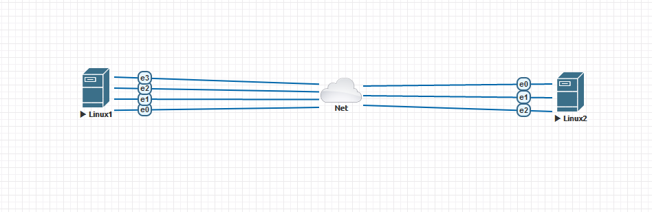

1. Команда для проверки сетевых интерфейсов:
Linux - `ip a` и различные аргументы, `ip link show`,а так же с помощью альтернативного инструмента `nmtui`.\
Windows - `ipconfig /all`, `netsh interface show interface`.
2. Протокол для распознавания соседа по сетевому интерфейсу `LLDP`, для IPv6 это `NDP`. Пакет в Linux `lldpd`.\
Команды для обнаружения соседей `lldpctl` и `ip neigh show`.
3. Технология, используемая для разделения L2 коммутатора на несколько виртуальных сетей, называется `VLAN`. В Linux пакет называется `vlan`
Для создания `vlan` можно использовать пакет `vconfig`:
```
# Добавление VLAN
vconfig add [interface-name] [vlan_id]
# Удаление VLAN
vconfig rem [vlan-name]
```
А также можно использовать команду `ip` - Добавить VLAN: `ip link add link eth0 name vlan_15 type vlan id 15`.\
Удалить VLAN: `ip link delete vlan_15`.\
Пример конфига:
```
auto vlan15
iface vlan15 inet static
        address 192.168.1.1
        netmask 255.255.255.0
        vlan_raw_device eth0
```
Либо
```
auto eth0.15
iface eth0.15 inet static
        address 192.168.1.1
        netmask 255.255.255.0
        vlan_raw_device eth0
```
4. Типы агрегации интерфейсов в Linux:
- `Mode-0(balance-rr)` – Данный режим используется по умолчанию. Balance-rr обеспечивается балансировку нагрузки и отказоустойчивость. В данном режиме сетевые пакеты отправляются по кругу.
- `Mode-1(active-backup)` – Один из интерфейсов работает в активном режиме, остальные в ожидающем. При обнаружении проблемы на активном интерфейсе производится переключение на ожидающий интерфейс.
- `Mode-2(balance-xor)` – Передача пакетов распределяется по типу входящего и исходящего трафика. Режим дает балансировку нагрузки и отказоустойчивость.
- `Mode-3(broadcast)` – Происходит передача во все объединенные интерфейсы, тем самым обеспечивая отказоустойчивость.
- `Mode-4(802.3ad)` – динамическое объединение одинаковых портов. В данном режиме можно значительно увеличить пропускную способность входящего так и исходящего трафика.
- `Mode-5(balance-tlb)` – Адаптивная балансировки нагрузки трафика. Входящий трафик получается только активным интерфейсом, исходящий распределяется в зависимости от текущей загрузки канала каждого интерфейса.
- `Mode-6(balance-alb)` – Адаптивная балансировка нагрузки. Отличается более совершенным алгоритмом балансировки нагрузки чем `Mode-5`. Обеспечивается балансировку нагрузки как исходящего так и входящего трафика.
Опции есть для балансировки нагрузки:
- `ad_select` — определяет логику выбора для агрегации по стандарту `IEEE 802.3ad`.
- `arp_interval` — определяет ARP мониторинг канала.
- `arp_ip_target` — Указывает IP адреса для ARP мониторинга.
- `arp_validate` — Определяет будут или нет проверяться ARP запросы и ответы при использовании режима **active-backup**.
- `downdelay` — Определяет время (в миллисекундах) задержки перед отключением интерфейса, если произошел сбой соединения.
- `fail_over_mac` — Определяет как будут прописываться MAC адреса на объединенных интерфейсах в режиме **active-backup** при переключении интерфейсов.
- `lacp_rate` — Определяет с каким интервалом будут передаваться партнёром LACPDU пакеты в режиме **802.3a**.
- `max_bonds` — Указывает сколько bonding устройств следует создавать драйверу.
- `miimon` — Устанавливает периодичность MII мониторинга в миллисекундах.
- `num_grat_arp` и `num_unsol_na` — Указывает количество оповещений, отправляемых соседним пирам после возникновения события отказа и не затребованные оповещения IPv6.
- `primary` — Строка вида (eth0, eth1, и т.д.). Указывает какой интерфейс будет первичным.
- `primary_reselect` — Определяет как будет производиться возвращение на первичный интерфейс, после возобновления его работоспособности.
- `updelay` — Задает время задержки в миллисекундах, перед тем как поднять линк при обнаружении восстановления канала.
- `use_carrier` — Указывает как miimon будет определять состояние линии, используя контроль ввода-вывода.
- `xmit_hash_policy` — Определяет хэш политику передачи пакетов через объединенные интерфейсы в режиме **balance-xor** или **802.3ad**.
- `resend_igmp` — Указывает какое количество отчетов о принадлежности группе отсылать при возникновении события отказа.
```
#Пример конфига
auto bond0
iface bond0 inet dhcp
   bond-slaves eth0 eth1
   bond-mode active-backup
   bond-miimon 100
   bond-primary eth0 eth1
```
5. Всего IP адресов в сети с маской `/29` 8 адресов, но используется всего 6, так как первый используется для определения сети, а последний для широковещательных запросов.\
Из сети с маской `/24` можно получить 32 сети с маской `/29`, вот несколько примеров:
- `10.10.10.0/29`
- `10.10.10.8/29`
- `10.10.10.16/29`
6. Подсеть для организации стыка возьмем `100.64.0.0`, так как только данная подсеть остается не занята.
- `100.64.0.0/26`
- `100.64.0.64/26`
7. Для проверки ARP таблицы используем следующие команды:
- `Linux`
```
arp -a # Показать ARP таблицу
ip -s -s neigh flush all # Очистить ARP кеш
arp -d  <host> # Удалить запись с определённым ip
```
- `Windows`
```
arp -a # Отображает текущие ARP-записи
arp -d # Удаляет узел, задаваемый inet_addr
arp -d inet_addr # Удалить запись с определённым ip
```
8. Установили EVE-NG и настроили для нашего задания.
Создали простую схему подключения. Состоящей из основной ВМ(Где крутиться EVE-NG) и импровизированных двух серверов.

На 4 портах ВМ Linux настроили `valn 1` и `vlan 2`.
Командой `lldpctl` на основной ВМ убеждаемся, что `vlan` применились и их видно на соседе:
```
root@eve-ng:~# lldpctl
-------------------------------------------------------------------------------
LLDP neighbors:
-------------------------------------------------------------------------------
Interface:    vunl0_1_0, via: LLDP, RID: 9, Time: 0 day, 00:14:08
  Chassis:
    ChassisID:    mac 00:50:00:00:01:00
    SysName:      linux1
    SysDescr:     Ubuntu 20.04.2 LTS Linux 5.4.0-91-generic #102-Ubuntu SMP Fri Nov 5 16:31:28 UTC 2021 x86_64
    MgmtIP:       192.168.255.10
    MgmtIP:       fe80::250:ff:fe00:100
    Capability:   Bridge, off
    Capability:   Router, off
    Capability:   Wlan, off
    Capability:   Station, on
  Port:
    PortID:       mac 00:50:00:00:01:00
    PortDescr:    ens3
  VLAN:         1 NET.3
-------------------------------------------------------------------------------
Interface:    vunl0_1_1, via: LLDP, RID: 9, Time: 0 day, 00:14:04
  Chassis:
    ChassisID:    mac 00:50:00:00:01:00
    SysName:      linux1
    SysDescr:     Ubuntu 20.04.2 LTS Linux 5.4.0-91-generic #102-Ubuntu SMP Fri Nov 5 16:31:28 UTC 2021 x86_64
    MgmtIP:       192.168.255.10
    MgmtIP:       fe80::250:ff:fe00:100
    Capability:   Bridge, off
    Capability:   Router, off
    Capability:   Wlan, off
    Capability:   Station, on
  Port:
    PortID:       mac 00:50:00:00:01:01
    PortDescr:    ens4
  VLAN:         1 NET.4
-------------------------------------------------------------------------------
Interface:    vunl0_1_2, via: LLDP, RID: 9, Time: 0 day, 00:13:05
  Chassis:
    ChassisID:    mac 00:50:00:00:01:00
    SysName:      linux1
    SysDescr:     Ubuntu 20.04.2 LTS Linux 5.4.0-91-generic #102-Ubuntu SMP Fri Nov 5 16:31:28 UTC 2021 x86_64
    MgmtIP:       192.168.255.10
    MgmtIP:       fe80::250:ff:fe00:100
    Capability:   Bridge, off
    Capability:   Router, off
    Capability:   Wlan, off
    Capability:   Station, on
  Port:
    PortID:       mac 00:50:00:00:01:02
    PortDescr:    ens5
  VLAN:         2 RES.5
-------------------------------------------------------------------------------
Interface:    vunl0_1_3, via: LLDP, RID: 9, Time: 0 day, 00:13:00
  Chassis:
    ChassisID:    mac 00:50:00:00:01:00
    SysName:      linux1
    SysDescr:     Ubuntu 20.04.2 LTS Linux 5.4.0-91-generic #102-Ubuntu SMP Fri Nov 5 16:31:28 UTC 2021 x86_64
    MgmtIP:       192.168.255.10
    MgmtIP:       fe80::250:ff:fe00:100
    Capability:   Bridge, off
    Capability:   Router, off
    Capability:   Wlan, off
    Capability:   Station, on
  Port:
    PortID:       mac 00:50:00:00:01:03
    PortDescr:    ens6
  VLAN:         2 RES.6
```

Конфиг для `Bonding`:
```
auto ens4
iface ens4 inet manual
bond-master bond0
bond-primary ens4 ens5
auto ens5
iface ens5 inet manual
bond-master bond0
bond-primary ens4 ens5
auto bond0
iface bond0 inet static
address 192.168.255.100
netmask 255.255.255.0
gateway 192.168.255.1
     slaves ens4 ens5
     bond_mode 1
     bond-miimon 100
     bond_downdelay 0
     bound_updelay 0
```
Успешный перезапуск сервиса и наш `bond0` готов и работает,
```
root@linux2:/etc/network# systemctl status networking.service
● networking.service - Raise network interfaces
     Loaded: loaded (/lib/systemd/system/networking.service; enabled; vendor preset: enabled)
     Active: active (exited) since Sun 2021-12-12 04:40:43 UTC; 3s ago
       Docs: man:interfaces(5)
    Process: 5197 ExecStart=/sbin/ifup -a --read-environment (code=exited, status=0/SUCCESS)
   Main PID: 5197 (code=exited, status=0/SUCCESS)

Dec 12 04:40:43 linux2 systemd[1]: Starting Raise network interfaces...
Dec 12 04:40:43 linux2 ifup[5209]: Waiting for bond master bond0 to be ready
Dec 12 04:40:43 linux2 ifup[5197]: ifup: waiting for lock on /run/network/ifstate.bond0
Dec 12 04:40:43 linux2 systemd[1]: Finished Raise network interfaces.

root@linux2:/etc/network# ip a
1: lo: <LOOPBACK,UP,LOWER_UP> mtu 65536 qdisc noqueue state UNKNOWN group default qlen 1000
    link/loopback 00:00:00:00:00:00 brd 00:00:00:00:00:00
    inet 127.0.0.1/8 scope host lo
       valid_lft forever preferred_lft forever
    inet6 ::1/128 scope host
       valid_lft forever preferred_lft forever
2: ens3: <BROADCAST,MULTICAST,UP,LOWER_UP> mtu 1500 qdisc fq_codel state UP group default qlen 1000
    link/ether 00:50:00:00:02:00 brd ff:ff:ff:ff:ff:ff
    inet 192.168.255.11/24 brd 192.168.255.255 scope global dynamic ens3
       valid_lft 402sec preferred_lft 402sec
    inet6 fe80::250:ff:fe00:200/64 scope link
       valid_lft forever preferred_lft forever
3: ens4: <BROADCAST,MULTICAST,SLAVE,UP,LOWER_UP> mtu 1500 qdisc fq_codel master bond0 state UP group default qlen 1000
    link/ether 00:50:00:00:02:01 brd ff:ff:ff:ff:ff:ff
4: ens5: <BROADCAST,MULTICAST,SLAVE,UP,LOWER_UP> mtu 1500 qdisc fq_codel master bond0 state UP group default qlen 1000
    link/ether 00:50:00:00:02:01 brd ff:ff:ff:ff:ff:ff
5: bond0: <BROADCAST,MULTICAST,MASTER,UP,LOWER_UP> mtu 1500 qdisc noqueue state UP group default qlen 1000
    link/ether 00:50:00:00:02:01 brd ff:ff:ff:ff:ff:ff
    inet 192.168.255.100/24 brd 192.168.255.255 scope global bond0
       valid_lft forever preferred_lft forever
    inet6 fe80::250:ff:fe00:201/64 scope link
       valid_lft forever preferred_lft forever
```
Посмотрели подробную информацию об интерфейсах входящих в `Bonding`:
```
root@linux2:/etc/network# cat /proc/net/bonding/bond0
Ethernet Channel Bonding Driver: v3.7.1 (April 27, 2011)

Bonding Mode: fault-tolerance (active-backup)
Primary Slave: ens4 (primary_reselect always)
Currently Active Slave: ens4
MII Status: up
MII Polling Interval (ms): 100
Up Delay (ms): 0
Down Delay (ms): 1000
Peer Notification Delay (ms): 0

Slave Interface: ens4
MII Status: up
Speed: Unknown
Duplex: Unknown
Link Failure Count: 0
Permanent HW addr: 00:50:00:00:02:01
Slave queue ID: 0

Slave Interface: ens5
MII Status: up
Speed: Unknown
Duplex: Unknown
Link Failure Count: 0
Permanent HW addr: 00:50:00:00:02:02
Slave queue ID: 0
```
На основной ВМ видим что 2 порта находятся в состоянии агрегации:
```
root@eve-ng:~# lldpctl
-------------------------------------------------------------------------------
LLDP neighbors:
-------------------------------------------------------------------------------
Interface:    vunl0_2_0, via: LLDP, RID: 16, Time: 0 day, 00:33:07
  Chassis:
    ChassisID:    mac 00:50:00:00:02:00
    SysName:      linux2
    SysDescr:     Ubuntu 20.04.2 LTS Linux 5.4.0-91-generic #102-Ubuntu SMP Fri Nov 5 16:31:28 UTC 2021 x86_64
    MgmtIP:       192.168.255.11
    MgmtIP:       fe80::250:ff:fe00:200
    Capability:   Bridge, off
    Capability:   Router, off
    Capability:   Wlan, off
    Capability:   Station, on
  Port:
    PortID:       mac 00:50:00:00:02:00
    PortDescr:    ens3
-------------------------------------------------------------------------------
Interface:    vunl0_2_1, via: LLDP, RID: 16, Time: 0 day, 00:06:06
  Chassis:
    ChassisID:    mac 00:50:00:00:02:00
    SysName:      linux2
    SysDescr:     Ubuntu 20.04.2 LTS Linux 5.4.0-91-generic #102-Ubuntu SMP Fri Nov 5 16:31:28 UTC 2021 x86_64
    MgmtIP:       192.168.255.11
    MgmtIP:       fe80::250:ff:fe00:200
    Capability:   Bridge, off
    Capability:   Router, off
    Capability:   Wlan, off
    Capability:   Station, on
  Port:
    PortID:       mac 00:50:00:00:02:01
    PortDescr:    ens4
    Port is aggregated. PortAggregID: 7
-------------------------------------------------------------------------------
Interface:    vunl0_2_2, via: LLDP, RID: 16, Time: 0 day, 00:06:06
  Chassis:
    ChassisID:    mac 00:50:00:00:02:00
    SysName:      linux2
    SysDescr:     Ubuntu 20.04.2 LTS Linux 5.4.0-91-generic #102-Ubuntu SMP Fri Nov 5 16:31:28 UTC 2021 x86_64
    MgmtIP:       192.168.255.11
    MgmtIP:       fe80::250:ff:fe00:200
    Capability:   Bridge, off
    Capability:   Router, off
    Capability:   Wlan, off
    Capability:   Station, on
  Port:
    PortID:       mac 00:50:00:00:02:02
    PortDescr:    ens5
    Port is aggregated. PortAggregID: 7
-------------------------------------------------------------------------------
```

