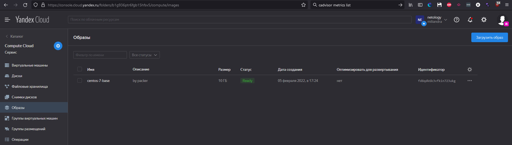
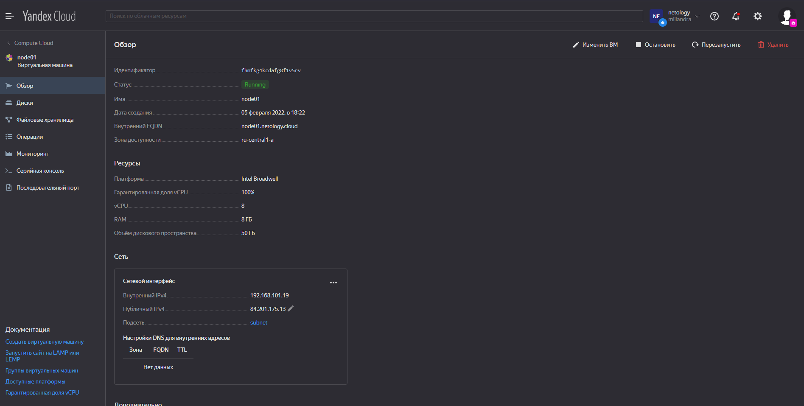
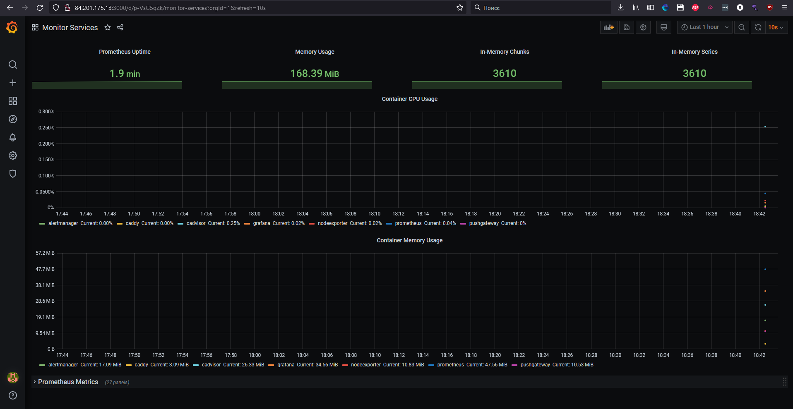
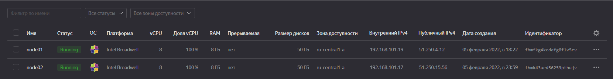
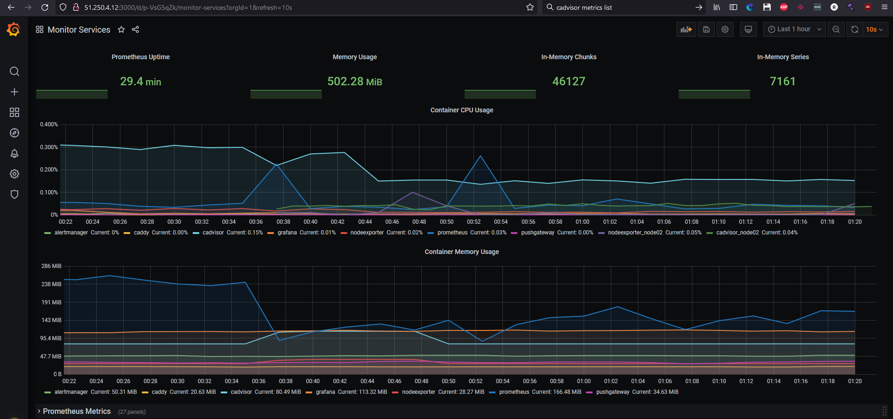
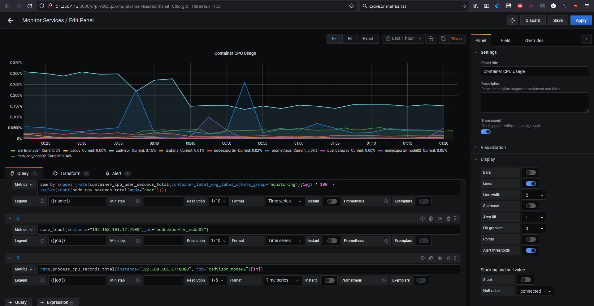

1. Создали собственный образ операционной системы с помощью Packer:
```
Build 'yandex' finished after 1 minute 59 seconds.

==> Wait completed after 1 minute 59 seconds

==> Builds finished. The artifacts of successful builds are:
--> yandex: A disk image was created: centos-7-base (id: fd8qdk6k3vfkin723ukg) with family name centos
root@vagrant:~/Packer# yc compute image list
+----------------------+---------------+--------+----------------------+--------+
|          ID          |     NAME      | FAMILY |     PRODUCT IDS      | STATUS |
+----------------------+---------------+--------+----------------------+--------+
| fd8qdk6k3vfkin723ukg | centos-7-base | centos | f2eacrudv331nbat9ehb | READY  |
+----------------------+---------------+--------+----------------------+--------+
```

2. Создали ВМ в Яндекс.Облаке:

3. Развернули компонент мониторинга, состоящий из стека микросервисов:

4. Создали вторую ВМ с `nodeexporter` и `cadvisor`. Назвали `node02`. Подключили вторую ВМ к мониторингу, развёрнутому на первом сервере. Отличаются ip адреса, по сравнению с 3 заданием, так как выключали первый сервер.



