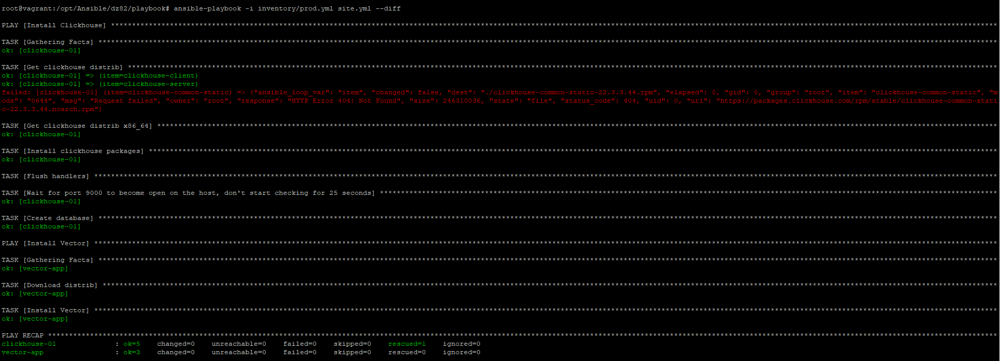

1. Подготовили свой inventory файл [prod.yml](https://github.com/Miliandra/08-02-ansible/blob/main/playbook/inventory/prod.yml).
2. Дописали свой playbook с установкой vector и добавили ожидание поднятие порта `9000` перед создание дб(Так как база не создавалась).
   - 
3. При создании tasks ииспользовали модули: `get_url`.
4. Tasks успешно скачал нужную версию дистрибутива и установил `vector`.
5. Запустили `ansible-lint site.yml` и исправили ошибки.
   - 
6. Запустили playbook на этом окружении с флагом `--check`.
   - 
7. Запустили playbook на `prod.yml` с флагом `--diff`. И убедились, что изменения на системе произведены.
   - 
8. Повторно запустите playbook с флагом `--diff` и убедитесь, что playbook идемпотентен.
   - 
9. Подготовили README.md файл по-своему playbook. В playbook описано каждое действие в комментариях.
10. Ссылка на мой [playbook](https://github.com/Miliandra/08-02-ansible).
