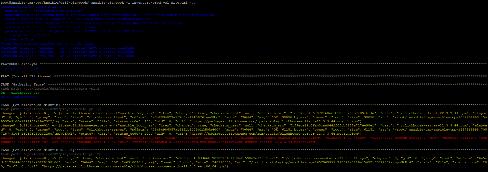
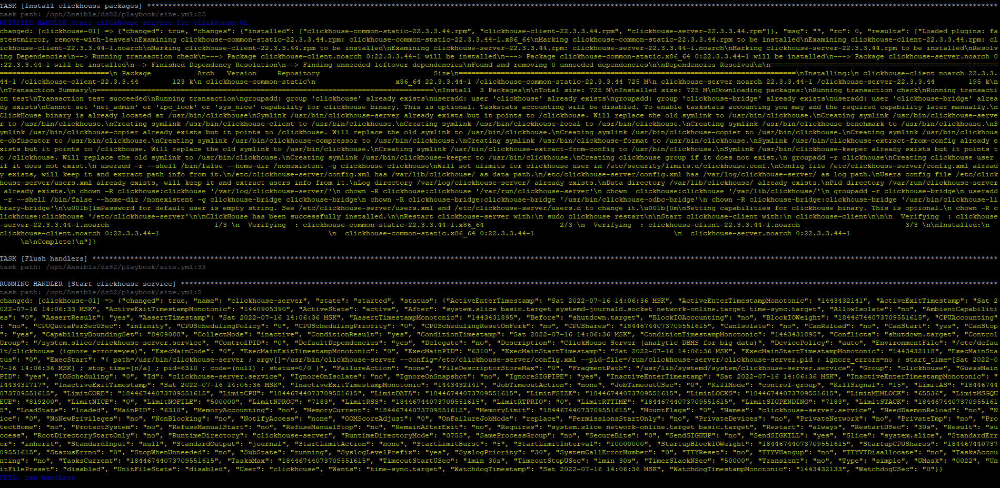
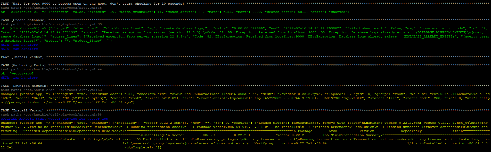
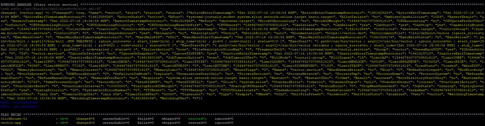
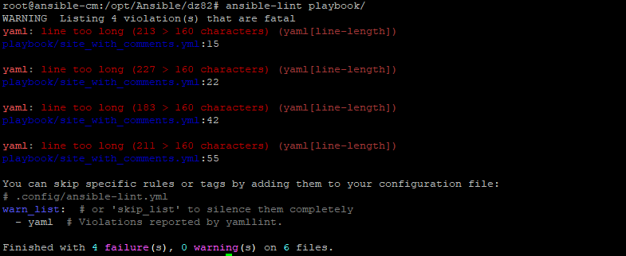

Приложил скрины с выполнением Playbook `site.yml`:

Так же скрины с выполнением `ansible-lint`:

4 ошибки при выполнении `ansible-lint` - это из-за комментариев к командам. Если комментарии убрать, данные ошибки исчезнут

Критических ошибок при выполнении `playbook` не замечено.
