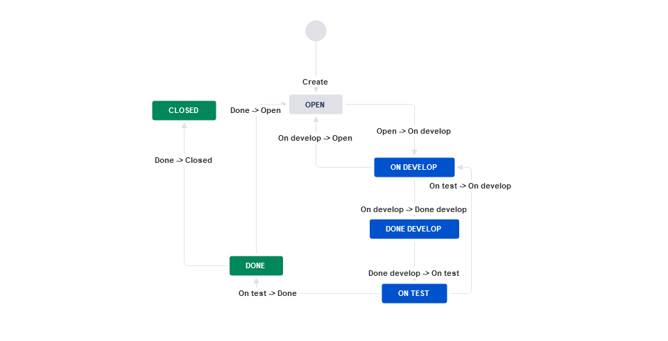

### Workflow для багов:

### Workflow для остальных задач:
\
#### Так же прикладываем схемы в xml:
- [Bug Task.xml](src/Bug_Task.xml)
- [All Other Task.xml](src/All_Other_Task.xml)
## Дополнительно скриншоты о успешно выполненных действиях
Kanban Test

Scrum Test

