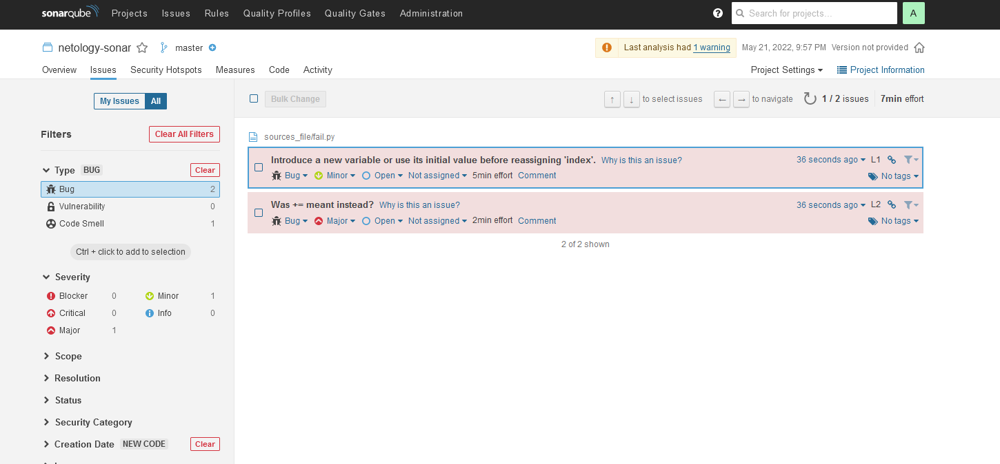
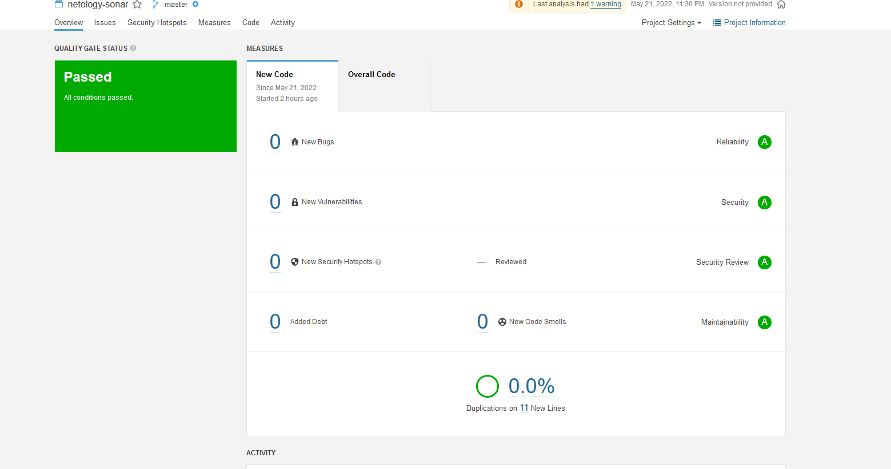
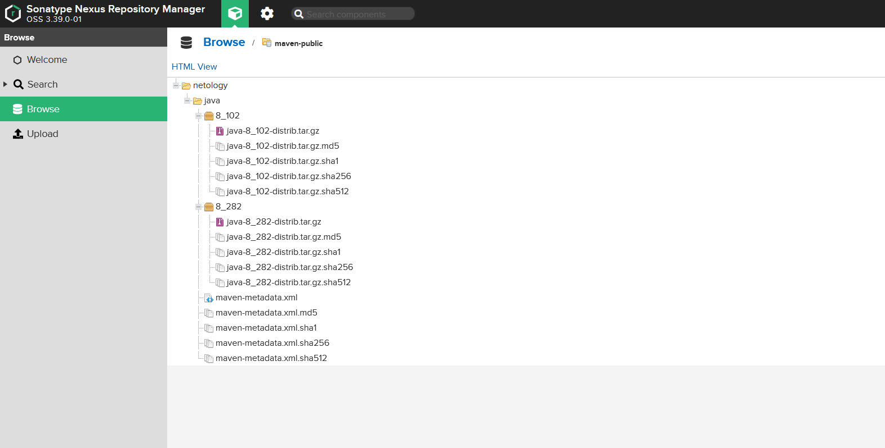

### Знакомство с SonarQube
1. Создали новый проект `netology-sonar`
2. Скачали пакет sonar-scanner:
```bash
[root@dz sonar-scanner]# wget https://binaries.sonarsource.com/Distribution/sonar-scanner-cli/sonar-scanner-cli-4.7.0.2747-linux.zip
```
3. Сделали доступный binary:
```sh
[root@dz sonar-scanner]# export PATH=$PATH:/opt/sonar-scanner/bin
[root@dz sonar-scanner]# echo $PATH
/root/yandex-cloud/bin:/usr/local/sbin:/usr/local/bin:/usr/sbin:/usr/bin:/root/bin:/opt/sonar-scanner/:/opt/sonar-scanner/bin
```
4. Проверяем `sonar-scanner --version`:
```bash
[root@dz sonar-scanner]# sonar-scanner --version
INFO: Scanner configuration file: /opt/sonar-scanner/conf/sonar-scanner.properties
INFO: Project root configuration file: NONE
INFO: SonarScanner 4.7.0.2747
INFO: Java 11.0.14.1 Eclipse Adoptium (64-bit)
INFO: Linux 3.10.0-1160.el7.x86_64 amd64
```
5. Запустили анализатор:
```bash
[root@dz sonar-scanner]# sonar-scanner -Dsonar.projectKey=netology-sonar -Dsonar.sources=/opt/sonar-scanner/sources_file -Dsonar.host.url=http://localhost:9000 -Dsonar.login=c1b0318f1aa510e41e5ee305c5637b50b080d1c2 -Dsonar.coverage.exclusions=fail.py
```
6. Наблюдаем 2 бага(ошибки):

7. Исправляем ошибки в коде:
```py
[root@dz sources_file]# cat fail.py
def increment(index):
	return index + 1
def get_square(numb):
    return numb*numb
def print_numb(numb):
    print("Number is {}".format(numb))

index = 0
while (index < 10):
    index = increment(index)
    print(get_square(index))
```
8. Запустили анализатор повторно и убедились в отсутствии ошибок:

### Знакомство с Nexus
Узнаем пароль от админа:
```bash
bash-4.4$ cat /nexus-data/admin.password
feacaf5f-8371-42b3-807f-78b5a2498bd4
```
Успешная загрузка наших артефактов:

Прислали файл `maven-metadata.xml` для наших артефактов:
[maven-metadata.xml](src/maven-metadata.xml)
### Знакомство с Maven
1. Скачали дистрибутив maven:
```bash
[root@dz maven]# wget https://downloads.apache.org/maven/maven-3/3.8.5/binaries/apache-maven-3.8.5-bin.zip
```
2. Сделали доступным через вызов shell:
```bash
[root@dz bin]# ln -s /opt/maven/bin/mvn /usr/bin/mvn
[root@dz bin]# chmod ugo+x /usr/bin/mvn
```
3. Проверяем `mvn --version`:
```bash
[root@dz maven]# mvn -v
Apache Maven 3.8.5 (3599d3414f046de2324203b78ddcf9b5e4388aa0)
Maven home: /opt/maven
Java version: 1.8.0_332, vendor: Red Hat, Inc., runtime: /usr/lib/jvm/java-1.8.0-openjdk-1.8.0.332.b09-1.el7_9.x86_64/jre
Default locale: en_US, platform encoding: UTF-8
OS name: "linux", version: "3.10.0-1160.el7.x86_64", arch: "amd64", family: "unix"
```
### Основная часть
1. Поменяли в `pom.xml` блок с зависимостями под наш артефакт:
```xml
[root@dz dz_maven_pom]# cat pom.xml
<project xmlns="http://maven.apache.org/POM/4.0.0" xmlns:xsi="http://www.w3.org/2001/XMLSchema-instance"
  xsi:schemaLocation="http://maven.apache.org/POM/4.0.0 http://maven.apache.org/xsd/maven-4.0.0.xsd">
  <modelVersion>4.0.0</modelVersion>

  <groupId>com.netology.app</groupId>
  <artifactId>simple-app</artifactId>
  <version>1.0-SNAPSHOT</version>
   <repositories>
    <repository>
      <id>my-repo</id>
      <name>maven-public</name>
      <url>http://localhost:8081/repository/maven-public/</url>
    </repository>
  </repositories>
  <dependencies>
    <dependency>
      <groupId>netology</groupId>
      <artifactId>java</artifactId>
      <version>8_282</version>
      <classifier>distrib</classifier>
      <type>tar.gz</type>
    </dependency>
  </dependencies>
</project>
```
2. Запустили команду `mvn package`:
```bash
[INFO] Building jar: /opt/maven/dz_maven_pom/target/simple-app-1.0-SNAPSHOT.jar
[INFO] ------------------------------------------------------------------------
[INFO] BUILD SUCCESS
[INFO] ------------------------------------------------------------------------
[INFO] Total time:  17.960 s
[INFO] Finished at: 2022-05-22T00:07:01+03:00
[INFO] ------------------------------------------------------------------------
```
3. Проверили директорию `~/.m2/repository/netology/java/8_282/`
```bash
[root@dz ~]# ls -ls ~/.m2/repository/netology/java/8_282/
total 16
4 -rw-r--r--. 1 root root  20 May 22 00:06 java-8_282-distrib.tar.gz
4 -rw-r--r--. 1 root root  40 May 22 00:06 java-8_282-distrib.tar.gz.sha1
4 -rw-r--r--. 1 root root 382 May 22 00:06 java-8_282.pom.lastUpdated
4 -rw-r--r--. 1 root root 175 May 22 00:06 _remote.repositories
```
4. Справленный файл [pom.xml](src/pom.xml)
