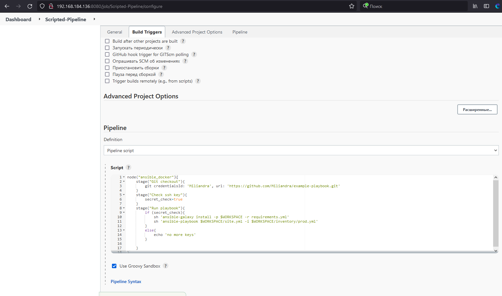

## Подготовка к выполнению

### 1. Установить jenkins по любой из [инструкций](https://www.jenkins.io/download/)
  - Установили:
```bash
sudo wget -O /etc/yum.repos.d/jenkins.repo https://pkg.jenkins.io/redhat-stable/jenkins.repo
sudo rpm --import https://pkg.jenkins.io/redhat-stable/jenkins.io.key
sudo yum upgrade
sudo yum install java-11-openjdk
sudo yum install jenkins
  ```
### 2. Запустить и проверить работоспособность
  - Запустили и проверили:
```bash
[root@dz run]# systemctl start jenkins
[root@dz run]# systemctl status jenkins
● jenkins.service - Jenkins Continuous Integration Server
   Loaded: loaded (/usr/lib/systemd/system/jenkins.service; enabled; vendor preset: disabled)
   Active: active (running) since Sun 2022-06-05 01:40:51 MSK; 17s ago
 Main PID: 9360 (java)
    Tasks: 52
   Memory: 478.1M
   CGroup: /system.slice/jenkins.service
           └─9360 /usr/bin/java -Djava.awt.headless=true -jar /usr/share/java/jenkins.war --webroot=%C/jenkins/war --httpPort=8080

Jun 05 01:40:56 dz.netology jenkins[9360]: at hudson.slaves.SlaveComputer.setChannel(SlaveComputer.java:436)
Jun 05 01:40:56 dz.netology jenkins[9360]: at hudson.slaves.CommandLauncher.launch(CommandLauncher.java:170)
Jun 05 01:40:56 dz.netology jenkins[9360]: at hudson.slaves.SlaveComputer.lambda$_connect$0(SlaveComputer.java:297)
Jun 05 01:40:56 dz.netology jenkins[9360]: at jenkins.util.ContextResettingExecutorService$2.call(ContextResettingExecutorService.java:46)
Jun 05 01:40:56 dz.netology jenkins[9360]: at jenkins.security.ImpersonatingExecutorService$2.call(ImpersonatingExecutorService.java:80)
Jun 05 01:40:56 dz.netology jenkins[9360]: at java.base/java.util.concurrent.FutureTask.run(FutureTask.java:264)
Jun 05 01:40:56 dz.netology jenkins[9360]: at java.base/java.util.concurrent.ThreadPoolExecutor.runWorker(ThreadPoolExecutor.java:1128)
Jun 05 01:40:56 dz.netology jenkins[9360]: at java.base/java.util.concurrent.ThreadPoolExecutor$Worker.run(ThreadPoolExecutor.java:628)
Jun 05 01:40:56 dz.netology jenkins[9360]: at java.base/java.lang.Thread.run(Thread.java:829)
```

### 3. Сделать первоначальную настройку
  - Так как Jenkins ругается на сборщиков в мастер ноде и советует их отключить, то так и сделаем:


### 4. Настроить под свои нужды
  - Настроили под себя
### 5. Поднять отдельный cloud
```bash
[root@dz run]# chmod 777 /var/run/docker.sock
```

### 6. Для динамических агентов можно использовать [образ](https://hub.docker.com/repository/docker/aragast/agent)
  - Взяли данный образ
### 7. Обязательный параметр: поставить label для динамических агентов: `ansible_docker`
  - Выполнено
  

### 8. Сделать форк репозитория с [playbook](https://github.com/aragastmatb/example-playbook)
  - Сделали [форк](https://github.com/Miliandra/example-playbook)
  
## Основная часть
---
Провели почти целый день для решения проблем, сначала с работой агентов(Изначально планировалось все сделать через Docker) и пробовали с отельными ВМ. В итоге пришли к решению через Clouds и динамических агентов.
А также была проблема в получение рабочей сборки(Подсмотрев в нашем чате по обучению), пришел к решению изменить файл `requirements.yml`:
```yaml
---
  - src: https://github.com/netology-code/mnt-homeworks-ansible.git
    scm: git
    version: "1.0.1"
    name: java 
    key_file: ./secret
```
---
### 1. Сделать Freestyle Job, который будет запускать `ansible-playbook` из форка репозитория
  - Команды для сборки и запуска `ansible-playbook`:
  ```bash
  ansible-galaxy install -p $WORKSPACE -r requirements.yml
  ansible-playbook $WORKSPACE/site.yml -i $WORKSPACE/inventory/prod.yml
  ```
  Вывод консоли:
  
  
### 2. Сделать Declarative Pipeline, который будет выкачивать репозиторий с плейбуком и запускать её
  - Pipeline script
  ```groovy
  pipeline {
    agent any
    stages {
        stage('Get code from GitHub') {
            steps {
                // Get some code from a GitHub repository
                git 'https://github.com/Miliandra/example-playbook.git'
            }
        }
        stage('Run ansible') {
            steps {
                sh 'ansible-galaxy install -p $WORKSPACE -r requirements.yml'
                sh 'ansible-playbook $WORKSPACE/site.yml -i $WORKSPACE/inventory/prod.yml'
            }
        }
    }
}
```
  
### 3. Перенести Declarative Pipeline в репозиторий в файл `Jenkinsfile`
  - Перенесли в файл `Jenkinsfile`
### 4. Перенастроить Job на использование `Jenkinsfile` из репозитория
  - Перенастроили и получили удачную сборку
  
### 5. Создать Scripted Pipeline, наполнить его скриптом из [pipeline](./pipeline)
  - Создали и наполнили скриптом
  
### 6. Заменить credentialsId на свой собственный
  - Заменили на свои
  - Готовый скрипт:
```groovy
  ode("ansible_docker"){
    stage("Git checkout"){
        git credentialsId: 'Miliandra', url: 'https://github.com/Miliandra/example-playbook.git'
    }
    stage("Check ssh key"){
        secret_check=true
    }
    stage("Run playbook"){
        if (secret_check){
            sh 'ansible-galaxy install -p $WORKSPACE -r requirements.yml'
            sh 'ansible-playbook $WORKSPACE/site.yml -i $WORKSPACE/inventory/prod.yml'
        }
        else{
            echo 'no more keys'
        }
        
    }
}
  ```
### 7. Проверить работоспособность, исправить ошибки, исправленный Pipeline вложить в репозиторий в файл `ScriptedJenkinsfile`
  
### 8. Отправить ссылку на репозиторий в ответе
  - [Ссылка на репозиторий](https://github.com/Miliandra/example-playbook)
