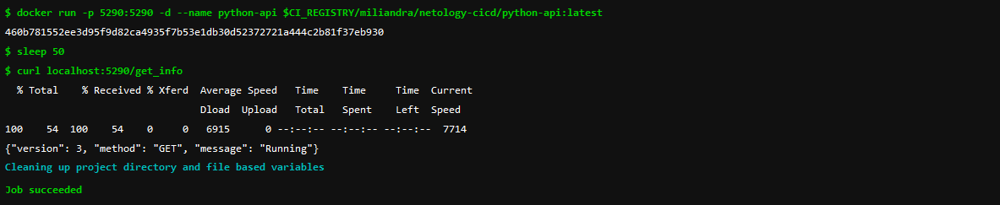

## Подготовка к выполнению

1. Необходимо зарегистрироваться
  - Уже были зарегистрированы 
2. Создайте свой новый проект
  - Сделали [Проект](https://gitlab.com/Miliandra/netology-cicd)
3. Создайте новый репозиторий в gitlab, наполните его файлами
  - Готово
4. Проект должен быть публичным, остальные настройки по желанию
  - Готово

## Основная часть

### DevOps

В репозитории содержится код проекта на python. Проект - RESTful API сервис. Ваша задача автоматизировать сборку образа с выполнением python-скрипта:
1. Образ собирается на основе [centos:7](https://hub.docker.com/_/centos?tab=tags&page=1&ordering=last_updated)
2. Python версии не ниже 3.7
3. Установлены зависимости: `flask` `flask-jsonpify` `flask-restful`
4. Создана директория `/python_api`
5. Скрипт из репозитория размещён в /python_api
6. Точка вызова: запуск скрипта
7. Если сборка происходит на ветке `master`: Образ должен пушится в docker registry вашего gitlab `python-api:latest`, иначе этот шаг нужно пропустить

  - Собрали образ как и требовалось, проблем не возникло.
  - Первичный файл `.gitlab-ci.yml`:
```yaml
  image: docker:latest
services:
    - docker:dind
stages:
  - build
  - test
  - deploy

docker-build:
  stage: build
  script:
    - docker login -u "$CI_REGISTRY_USER" -p "$CI_REGISTRY_PASSWORD" $CI_REGISTRY
    - docker build --pull -t $CI_REGISTRY/miliandra/netology-cicd/python-api:latest .
  rules:
    - if: $CI_COMMIT_BRANCH
      exists:
        - Dockerfile

docker-deploy:
  stage: deploy
  script:
    - docker login -u "$CI_REGISTRY_USER" -p "$CI_REGISTRY_PASSWORD" $CI_REGISTRY
    - docker build --pull -t $CI_REGISTRY/miliandra/netology-cicd/python-api:latest . 
    - docker push $CI_REGISTRY/miliandra/netology-cicd/python-api:latest
  only:
    - main
```

### Product Owner

Вашему проекту нужна бизнесовая доработка: необходимо поменять JSON ответа на вызов метода GET `/rest/api/get_info`, необходимо создать Issue в котором указать:
1. Какой метод необходимо исправить
2. Текст с `{ "message": "Already started" }` на `{ "message": "Running"}`
3. Issue поставить label: feature

  - Issue создали [Issue](https://gitlab.com/Miliandra/netology-cicd/-/issues/1)

### Developer

Вам пришел новый Issue на доработку, вам необходимо:
1. Создать отдельную ветку, связанную с этим issue
2. Внести изменения по тексту из задания
3. Подготовить Merge Requst, влить необходимые изменения в `master`, проверить, что сборка прошла успешно

  - Ветку создали и изменили наши два файла `.gitlab-ci.yml` и `python-api.py`:
```yaml
  image: docker:latest
services:
    - docker:dind
stages:
  - build
  - test
  - deploy

docker-build:
  stage: build
  script:
    - docker login -u "$CI_REGISTRY_USER" -p "$CI_REGISTRY_PASSWORD" $CI_REGISTRY
    - docker build --pull -t $CI_REGISTRY/miliandra/netology-cicd/python-api:latest .
  rules:
    - if: $CI_COMMIT_BRANCH
      exists:
        - Dockerfile

docker-test:
  stage: test
  script:
    - docker login -u "$CI_REGISTRY_USER" -p "$CI_REGISTRY_PASSWORD" $CI_REGISTRY
    - docker build --pull -t $CI_REGISTRY/miliandra/netology-cicd/python-api:latest .
    - docker run -p 5290:5290 -d --name python-api $CI_REGISTRY/miliandra/netology-cicd/python-api:latest
    - sleep 50
    - curl localhost:5290/get_info

docker-deploy:
  stage: deploy
  needs:
    - docker-test
  script:
    - docker login -u "$CI_REGISTRY_USER" -p "$CI_REGISTRY_PASSWORD" $CI_REGISTRY
    - docker build --pull -t $CI_REGISTRY/miliandra/netology-cicd/python-api:latest . 
    - docker push $CI_REGISTRY/miliandra/netology-cicd/python-api:latest
  only:
    - main 
```
  
```py
from flask import Flask, request
from flask_restful import Resource, Api
from json import dumps
from flask_jsonpify import jsonify

app = Flask(__name__)
api = Api(app)

class Info(Resource):
    def get(self):
        return {'version': 3, 'method': 'GET', 'message': 'Running'}

api.add_resource(Info, '/get_info')

if __name__ == '__main__':
     app.run(host='0.0.0.0', port='5290')

```
  - Сборка прошла успешно

  - Проверка в job тоже прошла успешно


### Tester

Разработчики выполнили новый Issue, необходимо проверить валидность изменений:
1. Поднять докер-контейнер с образом `python-api:latest` и проверить возврат метода на корректность
2. Закрыть Issue с комментарием об успешности прохождения, указав желаемый результат и фактически достигнутый

  - Подняли докер-контейнер с образом `python-api:latest`:
```bash
[root@dz ~]# docker pull registry.gitlab.com/miliandra/netology-cicd/python-api
Using default tag: latest
latest: Pulling from miliandra/netology-cicd/python-api
2d473b07cdd5: Already exists
7db80242efca: Pull complete
93ea32524e17: Pull complete
e03657a1d6ed: Pull complete
f61127458622: Pull complete
Digest: sha256:a2d040f08c7d4baafd51527e9dec985d4fc862d44d68f625658f693377ccbc8f
Status: Downloaded newer image for registry.gitlab.com/miliandra/netology-cicd/python-api:latest
registry.gitlab.com/miliandra/netology-cicd/python-api:latest
[root@dz ~]# docker images
REPOSITORY                                               TAG             IMAGE ID       CREATED          SIZE
registry.gitlab.com/miliandra/netology-cicd/python-api   latest          2006f7561bc9   29 minutes ago   432MB
[root@dz ~]# docker run -p 5290:5290 -d --name python-api registry.gitlab.com/miliandra/netology-cicd/python-api
3bb549fbda69eff598ae93fc8b059f1f6252359a745f78d59f5696e36f29357c
[root@dz ~]# docker ps
CONTAINER ID   IMAGE                                                    COMMAND                  CREATED         STATUS             PORTS                                                                                      NAMES
3bb549fbda69   registry.gitlab.com/miliandra/netology-cicd/python-api   "python3 /python_api…"   3 seconds ago   Up 3 seconds       0.0.0.0:5290->5290/tcp, :::5290->5290/tcp                                                  python-api
```
  - Проверили возврат метода на корректность:
```bash
[root@dz ~]# curl localhost:5290/get_info
{"version": 3, "method": "GET", "message": "Running"}
```
