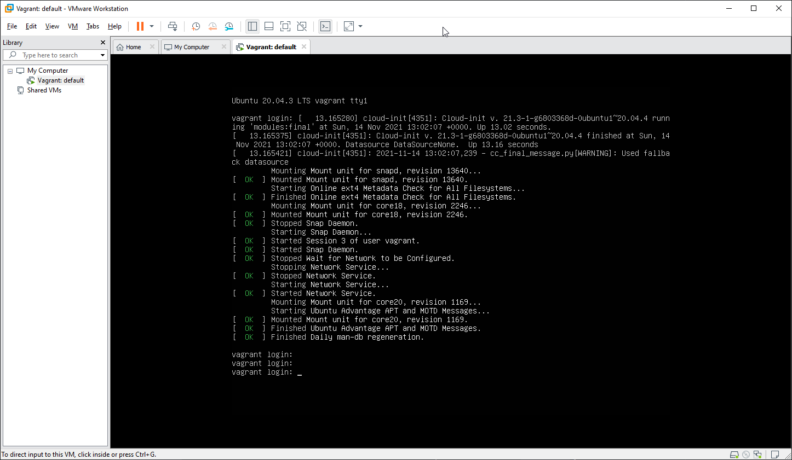
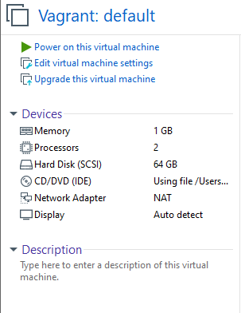

1. Установлено средство виртуализации VMware Workstation.
2. Установлено средство автоматизации Hashicorp Vagrant.
3. Подготовлен терминал для подключений mRemoteNG.
4. Создана директория для конфигурационных файлов.\
В ней выполнена команда `vagrant init`.\
Заменено содержимое **Vagrantfile**.\
Выполнены команды `vagrant up` и `vagrant suspend`, `vagrant halt`

5. Ознакомлен с графическим интерфейсом VirtualBox. Сам пользуюсь VMware Workstation.\

6. Добавление ресурсов ВМ происходит с помощью изменения `Vagrantfile` и добавления в него данных строчек:\
`config.vm.provider "vmware_desktop" do |v|`\
`v.vmx["memsize"] = "1024"`\
`v.vmx["numvcpus"] = "2"`\
`end`
7. Выполнено успешно.
8. Для настройки `history` можно использовать вот эти две переменные:
* `HISTFILESIZE` - максимальное число строк в файле истории для сохранения, Cтрока 844.
* `HISTSIZE` - число команд для сохранения  , строка 862.\
Существует два флага, `ignoredups` и `ignorespace`.Первый указывает, что нужно игнорировать команды, которые уже имеются в истории.\
Второй указывает, что нужно игнорировать команды, начинающиеся с пробела.\
Для установки двух значений, используется флаг `ignoreboth`.
9. `{...}` - используется в различных условных циклах, условных операторах, или ограничивает тело функции, в отличии от `(...)` исполнятся в текущем инстансе. Строка 257.
10. touch {1..100000}.txt - создаст в текущей директории соответствующее число фалов.\
300000 - создать не удасться, так как это слишком длинный список аргументов.
11. Данное условие у `[[ -d /tmp ]]` проверяет существует ли данный файл и является ли он каталогом /tmp.
12. Выполненные комманды для достижения результата:
* `mkdir /tmp/new_path_directory`
* `cp /bin/bash /tmp/new_path_directory/`
* `PATH=/tmp/new_path_directory/:$PATH`
13. Отличие планирование команд с помощью `batch` и `at`:
* `at` - выполняет команды в указанное время.
* `batch` -  выполняет команды, когда это позволяет уровень загрузки системы. Другими словами, когда среднее значение нагрузки системы падает ниже 1,5 или ниже значения указанного при вызове `atd`.
14. Выполнено: `vagrant halt`.
