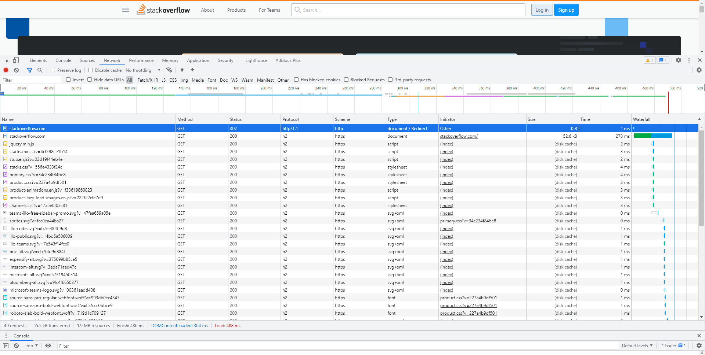

1. Код состояния HTTP 301 или Moved Permanently - код ответа HTTP, получаемый в ответ от сервера в ситуации, когда запрошенный ресурс был на постоянной основе перемещён в новое место. А так же указано немного технической информации.
```
HTTP/1.1 301 Moved Permanently
cache-control: no-cache, no-store, must-revalidate
location: https://stackoverflow.com/questions
x-request-guid: f76a9cb5-3d6c-496c-a4b4-b7eda11d977a
feature-policy: microphone 'none'; speaker 'none'
content-security-policy: upgrade-insecure-requests; frame-ancestors 'self' https://stackexchange.com
Accept-Ranges: bytes
Date: Sat, 27 Nov 2021 17:08:52 GMT
Via: 1.1 varnish
Connection: close
X-Served-By: cache-ams21066-AMS
X-Cache: MISS
X-Cache-Hits: 0
X-Timer: S1638032932.341688,VS0,VE77
Vary: Fastly-SSL
X-DNS-Prefetch-Control: off
Set-Cookie: prov=928efdca-f452-b8f3-90bc-c171d94c51d1; domain=.stackoverflow.com; expires=Fri, 01-Jan-2055 00:00:00 GMT; path=/; HttpOnly

Connection closed by foreign host.
```
2. Из-за того что мы обращались по 80 порту (http), то произошел редирект на 443 порт (https), в чём мы можем убедиться получив статус `307 Internal Redirect`.\
Дольше всего обрабатывался запрос на получения HTML документа.

3. Узнать свой внешний ip можно несколькими способами:
```
wget -qO- eth0.me

curl 2ip.ru
```
4. Командой `whois <my_ip> | grep address` узнаем кому принадлежит мой IP, а командой `whois <my_ip> | grep origin` узнаем AS.
5. Узнаем командой, `traceroute -4An -i eth0 8.8.8.8`, предварительно установив ее:
```
traceroute to 8.8.8.8 (8.8.8.8), 30 hops max, 60 byte packets
 1  192.168.1.1 [*]  0.679 ms  1.335 ms  1.305 ms # My local network
 2  46.188.30.1 [AS8334]  2.208 ms  2.034 ms  2.172 ms # 2COM
 3  80.253.16.197 [AS39153]  2.151 ms  2.134 ms  2.116 ms # Setel LLC
 4  80.253.16.81 [AS39153]  2.429 ms  2.410 ms  2.390 ms # Setel LLC
 5  * * *
 6  108.170.250.33 [AS15169]  3.595 ms 108.170.250.129 [AS15169]  2.773 ms  2.836 ms Google LLC
 7  108.170.250.113 [AS15169]  1.909 ms 108.170.250.83 [AS15169]  2.274 ms 108.170.250.99 [AS15169]  2.467 ms Google LLC
 8  142.251.49.158 [AS15169]  15.741 ms 142.251.49.78 [AS15169]  17.341 ms 142.251.49.24 [AS15169]  15.317 ms Google LLC
 9  108.170.235.204 [AS15169]  14.818 ms 172.253.65.82 [AS15169]  14.016 ms 216.239.43.20 [AS15169]  23.161 ms Google LLC
10  216.239.46.243 [AS15169]  16.384 ms 172.253.51.221 [AS15169]  20.309 ms 142.250.56.221 [AS15169]  18.112 ms Google LLC
11  * * * 
12  * * *
13  * * *
14  * * *
15  * * *
16  * * *
17  * * *
18  * * *
19  * * 8.8.8.8 [AS15169]  18.885 ms Google LLC
```
6. Используем команду `mtr -zn 8.8.8.8`
```
Host                                                                            Loss%   Snt   Last   Avg  Best  Wrst StDev
 1. AS???    192.168.1.1                                                          0.0%    33    0.4   0.4   0.3   1.1   0.1
 2. AS8334   46.188.30.1                                                          0.0%    33    1.0   1.1   0.9   1.4   0.1
 3. AS39153  80.253.16.197                                                        3.0%    33    1.0   2.2   1.0  12.2   2.6
 4. AS39153  80.253.16.81                                                         0.0%    33    1.5   1.6   1.4   1.9   0.1
 5. AS15169  108.170.250.129                                                      0.0%    33    2.5   2.7   2.4   3.8   0.3
 6. AS15169  108.170.250.146                                                      0.0%    33    1.8   2.7   1.6  11.8   2.5
 7. AS15169  142.250.239.64                                                      30.3%    33   14.1  16.1  13.8  42.3   6.8
 8. AS15169  216.239.48.224                                                       0.0%    33   16.2  18.6  16.0  58.8   7.7
 9. AS15169  142.250.208.23                                                       0.0%    33   15.1  15.8  15.0  17.6   0.6
10. (waiting for reply)
11. (waiting for reply)
12. (waiting for reply)
13. (waiting for reply)
14. (waiting for reply)
15. (waiting for reply)
16. AS15169  8.8.8.8                                                             84.4%    32   13.1  13.6  13.1  14.3   0.6
```
Наибольшая задержка происходит на `ip 216.239.48.224`, еще имеются и потери на `80.253.16.197` и `142.250.239.64`.

7. Выполнили команду `dig dns.google`:
```
; <<>> DiG 9.16.1-Ubuntu <<>> dns.google
;; QUESTION SECTION:
;dns.google.                    IN      A

;; ANSWER SECTION:
dns.google.             11      IN      A       8.8.4.4
dns.google.             11      IN      A       8.8.8.8
```
8. Проверим первый ip `dig -x 8.8.4.4`:
```
; <<>> DiG 9.16.1-Ubuntu <<>> -x 8.8.4.4
;; QUESTION SECTION:
;4.4.8.8.in-addr.arpa.          IN      PTR

;; ANSWER SECTION:
4.4.8.8.in-addr.arpa.   85379   IN      PTR     dns.google.
```
Проверим второй ip `dig -x 8.8.8.8`:
```
; <<>> DiG 9.16.1-Ubuntu <<>> -x 8.8.8.8
;; QUESTION SECTION:
;8.8.8.8.in-addr.arpa.          IN      PTR

;; ANSWER SECTION:
8.8.8.8.in-addr.arpa.   6684    IN      PTR     dns.google.
```

