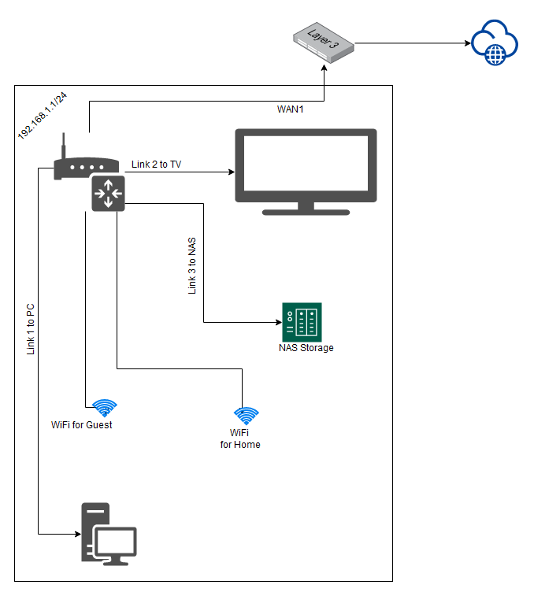

1. Используем команду `show ip route <IP>`:
```
Routing entry for 46.188.0.0/17
  Known via "bgp 6447", distance 20, metric 0
  Tag 6939, type external
  Last update from 64.71.137.241 2w6d ago
  Routing Descriptor Blocks:
  * 64.71.137.241, from 64.71.137.241, 2w6d ago
      Route metric is 0, traffic share count is 1
      AS Hops 3
      Route tag 6939
      MPLS label: none
```
Используем команду `show bgp <IP>`:
```
BGP routing table entry for 46.188.0.0/17, version 1371711763
Paths: (24 available, best #23, table default)
  Not advertised to any peer
  Refresh Epoch 3
  3303 6939 39153 8334
    217.192.89.50 from 217.192.89.50 (138.187.128.158)
      Origin IGP, localpref 100, valid, external
      Community: 3303:1006 3303:1021 3303:1030 3303:3067 6939:7154 6939:8233 6939:9002
      path 7FE13EF6DB10 RPKI State not found
      rx pathid: 0, tx pathid: 0
  Refresh Epoch 1
  4901 6079 3356 12389 39153 39153 8334
    162.250.137.254 from 162.250.137.254 (162.250.137.254)
      Origin IGP, localpref 100, valid, external
      Community: 65000:10100 65000:10300 65000:10400
      path 7FE022A442B8 RPKI State not found
      rx pathid: 0, tx pathid: 0
  Refresh Epoch 1
  7660 2516 12389 39153 39153 8334
    203.181.248.168 from 203.181.248.168 (203.181.248.168)
      Origin incomplete, localpref 100, valid, external
      Community: 2516:1050 7660:9003
      path 7FE0F227F888 RPKI State not found
      rx pathid: 0, tx pathid: 0
  Refresh Epoch 1
  3267 39153 8334
    194.85.40.15 from 194.85.40.15 (185.141.126.1)
      Origin incomplete, metric 0, localpref 100, valid, external
      path 7FE1249DA3D8 RPKI State not found
      rx pathid: 0, tx pathid: 0
  Refresh Epoch 1
  57866 28917 39153 39153 8334
    37.139.139.17 from 37.139.139.17 (37.139.139.17)
      Origin IGP, metric 0, localpref 100, valid, external
      Community: 0:6939 0:16276 28917:2000 28917:5310 28917:5320 39153:10 39153:509 57866:304 57866:501
      path 7FE0292C51B8 RPKI State not found
      rx pathid: 0, tx pathid: 0
  Refresh Epoch 1
  7018 3356 12389 39153 39153 8334
    12.0.1.63 from 12.0.1.63 (12.0.1.63)
      Origin IGP, localpref 100, valid, external
      Community: 7018:5000 7018:37232
      path 7FE097A72DC0 RPKI State not found
      rx pathid: 0, tx pathid: 0
  Refresh Epoch 1
  3333 1103 12389 39153 39153 8334
    193.0.0.56 from 193.0.0.56 (193.0.0.56)
      Origin incomplete, localpref 100, valid, external
      Community: 39153:10 39153:510
      path 7FE0A0CD6B08 RPKI State not found
      rx pathid: 0, tx pathid: 0
  Refresh Epoch 1
  49788 12552 28917 39153 39153 8334
    91.218.184.60 from 91.218.184.60 (91.218.184.60)
      Origin incomplete, localpref 100, valid, external
      Community: 12552:12000 12552:12100 12552:12101 12552:22000
      Extended Community: 0x43:100:1
      path 7FE00C459D90 RPKI State not found
      rx pathid: 0, tx pathid: 0
  Refresh Epoch 1
  20912 3257 28917 39153 39153 8334
    212.66.96.126 from 212.66.96.126 (212.66.96.126)
      Origin incomplete, localpref 100, valid, external
      Community: 3257:4000 3257:8133 3257:50001 3257:50110 3257:54901 20912:65004
      path 7FE17222A7C8 RPKI State not found
      rx pathid: 0, tx pathid: 0
  Refresh Epoch 1
  8283 28917 39153 39153 8334
    94.142.247.3 from 94.142.247.3 (94.142.247.3)
      Origin incomplete, metric 0, localpref 100, valid, external
      Community: 0:6939 0:16276 8283:1 8283:101 28917:2000 28917:5310 28917:5320 39153:10 39153:509
      unknown transitive attribute: flag 0xE0 type 0x20 length 0x18
        value 0000 205B 0000 0000 0000 0001 0000 205B
              0000 0005 0000 0001
      path 7FE0C04534B0 RPKI State not found
      rx pathid: 0, tx pathid: 0
  Refresh Epoch 1
  3356 12389 39153 39153 8334
    4.68.4.46 from 4.68.4.46 (4.69.184.201)
      Origin IGP, metric 0, localpref 100, valid, external
      Community: 3356:2 3356:22 3356:100 3356:123 3356:501 3356:903 3356:2065 39153:10 39153:510
      path 7FE03232EFF0 RPKI State not found
      rx pathid: 0, tx pathid: 0
  Refresh Epoch 1
  1221 4637 12389 39153 39153 8334
    203.62.252.83 from 203.62.252.83 (203.62.252.83)
      Origin incomplete, localpref 100, valid, external
      path 7FE048DAB6E0 RPKI State not found
      rx pathid: 0, tx pathid: 0
  Refresh Epoch 1
  2497 12389 39153 39153 8334
    202.232.0.2 from 202.232.0.2 (58.138.96.254)
      Origin incomplete, localpref 100, valid, external
      path 7FE0E39FF728 RPKI State not found
      rx pathid: 0, tx pathid: 0
  Refresh Epoch 1
  852 3356 12389 39153 39153 8334
    154.11.12.212 from 154.11.12.212 (96.1.209.43)
      Origin IGP, metric 0, localpref 100, valid, external
      path 7FE0A6F91338 RPKI State not found
      rx pathid: 0, tx pathid: 0
  Refresh Epoch 1
  20130 6939 39153 8334
    140.192.8.16 from 140.192.8.16 (140.192.8.16)
      Origin IGP, localpref 100, valid, external
      path 7FE11A5A19B8 RPKI State not found
      rx pathid: 0, tx pathid: 0
  Refresh Epoch 1
  701 1273 12389 39153 39153 8334
    137.39.3.55 from 137.39.3.55 (137.39.3.55)
      Origin incomplete, localpref 100, valid, external
      path 7FE0DFD9D398 RPKI State not found
      rx pathid: 0, tx pathid: 0
  Refresh Epoch 1
  3257 28917 39153 39153 8334
    89.149.178.10 from 89.149.178.10 (213.200.83.26)
      Origin incomplete, metric 10, localpref 100, valid, external
      Community: 3257:4000 3257:8133 3257:50001 3257:50110 3257:54901
      path 7FE0BA1187D0 RPKI State not found
      rx pathid: 0, tx pathid: 0
  Refresh Epoch 1
  3549 3356 12389 39153 39153 8334
    208.51.134.254 from 208.51.134.254 (67.16.168.191)
      Origin IGP, metric 0, localpref 100, valid, external
      Community: 3356:2 3356:22 3356:100 3356:123 3356:501 3356:903 3356:2065 3549:2581 3549:30840 39153:10 39153:510
      path 7FE0A704E0E0 RPKI State not found
      rx pathid: 0, tx pathid: 0
  Refresh Epoch 1
  53767 14315 6453 6453 3356 12389 39153 39153 8334
    162.251.163.2 from 162.251.163.2 (162.251.162.3)
      Origin IGP, localpref 100, valid, external
      Community: 14315:5000 53767:5000
      path 7FE11FF9A508 RPKI State not found
      rx pathid: 0, tx pathid: 0
  Refresh Epoch 1
  101 3356 12389 39153 39153 8334
    209.124.176.223 from 209.124.176.223 (209.124.176.223)
      Origin IGP, localpref 100, valid, external
      Community: 101:20100 101:20110 101:22100 3356:2 3356:22 3356:100 3356:123 3356:501 3356:903 3356:2065 39153:10 39153:510
      Extended Community: RT:101:22100
      path 7FE11FAE11E8 RPKI State not found
      rx pathid: 0, tx pathid: 0
  Refresh Epoch 1
  3561 3910 3356 12389 39153 39153 8334
    206.24.210.80 from 206.24.210.80 (206.24.210.80)
      Origin IGP, localpref 100, valid, external
      path 7FE0DE6D9270 RPKI State not found
      rx pathid: 0, tx pathid: 0
  Refresh Epoch 1
  1351 6939 39153 8334
    132.198.255.253 from 132.198.255.253 (132.198.255.253)
      Origin IGP, localpref 100, valid, external
      path 7FE044B83FE0 RPKI State not found
      rx pathid: 0, tx pathid: 0
  Refresh Epoch 1
  6939 39153 8334
    64.71.137.241 from 64.71.137.241 (216.218.252.164)
      Origin IGP, localpref 100, valid, external, best
      unknown transitive attribute: flag 0xE0 type 0x20 length 0xC
        value 0000 21B7 0000 0777 0000 21B7
      path 7FE18B340048 RPKI State not found
      rx pathid: 0, tx pathid: 0x0
  Refresh Epoch 1
  19214 3257 28917 39153 39153 8334
    208.74.64.40 from 208.74.64.40 (208.74.64.40)
      Origin incomplete, localpref 100, valid, external
      Community: 3257:4000 3257:8133 3257:50001 3257:50110 3257:54901
      path 7FE0BAAF5600 RPKI State not found
      rx pathid: 0, tx pathid: 0
```
2. Этапы Создания dummy0 интерфейса:
```
ip link add dummy0 type dummy
ip addr add 192.168.184.130/24 dev dummy0
ip link set dummy0 up
ip route add 192.168.1.0/24 dev dummy0
ip route add 172.16.0.0/16 dev dummy0

root@vagrant:~# ip route
default via 192.168.184.2 dev eth0 proto dhcp src 192.168.184.128 metric 100
172.16.0.0/16 dev dummy0 scope link
192.168.1.0/24 dev dummy0 scope link
192.168.184.0/24 dev eth0 proto kernel scope link src 192.168.184.128
192.168.184.0/24 dev dummy0 proto kernel scope link src 192.168.184.130
192.168.184.2 dev eth0 proto dhcp scope link src 192.168.184.128 metric 100
```
3. Проверяем открытые TCP порты:
```
root@vagrant:~# netstat -tulpn
Active Internet connections (only servers)
Proto Recv-Q Send-Q Local Address           Foreign Address         State       PID/Program name
tcp        0      0 127.0.0.53:53           0.0.0.0:*               LISTEN      748/systemd-resolve # DNS
tcp        0      0 0.0.0.0:22              0.0.0.0:*               LISTEN      802/sshd: /usr/sbin # SSH
tcp6       0      0 :::22                   :::*                    LISTEN      802/sshd: /usr/sbin # SSH
udp        0      0 127.0.0.53:53           0.0.0.0:*                           748/systemd-resolve # DNS
udp        0      0 192.168.184.128:68      0.0.0.0:*                           746/systemd-network # BOOTP(BOOTPC), DHCP
```
4. Проверяем используемые UDP сокеты:
```
root@vagrant:~# ss -u -a
State           Recv-Q          Send-Q                          Local Address:Port                     Peer Address:Port         Process
UNCONN          0               0                               127.0.0.53%lo:domain                        0.0.0.0:*					  # DNS
UNCONN          0               0                        192.168.184.128%eth0:bootpc                        0.0.0.0:*					  # DHCP
```
5. L3 диаграмма моей домашней сети:\

