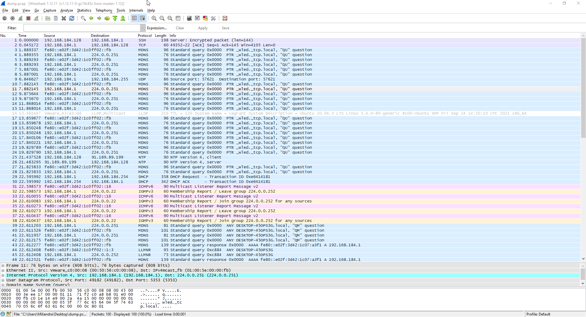

1. Выполнено
2. Выполнено
3. Устанавливаем `apache2` и начинаем создание самоподписанного сертификата:
```
root@vagrant:~# apt install apache2
root@vagrant:~# a2enmod ssl
Considering dependency setenvif for ssl:
Module setenvif already enabled
Considering dependency mime for ssl:
Module mime already enabled
Considering dependency socache_shmcb for ssl:
Enabling module socache_shmcb.
Enabling module ssl.

root@vagrant:~# openssl req -x509 -nodes -days 365 -newkey rsa:2048 -keyout /etc/ssl/private/apache.key -out /etc/ssl/certs/apache.crt -subj "/C=RU/ST=Moscow/L=Moscow/O=MyCompany/OU=MyOrg/CN=192.168.184.128"
Generating a RSA private key
......................................+++++
..............................................+++++
writing new private key to '/etc/ssl/private/apache.key'
```
Делаем конфиг для хоста:
```
<VirtualHost *:443>
    ServerName 192.168.184.128
    DocumentRoot /var/www/192.168.184.128
    SSLEngine on
    SSLCertificateFile /etc/ssl/certs/apache.crt
    SSLCertificateKeyFile /etc/ssl/private/apache.key
</VirtualHost>
<VirtualHost *:80>
    ServerName 192.168.184.128
    Redirect / https://192.168.184.128/
</VirtualHost>
```
Создаем папку под сайт и простенький `HTML`:
```
root@vagrant:/var/www/html# mkdir /var/www/192.168.184.128
root@vagrant:/var/www/192.168.184.128# vi index.html
```
Запускаем в работу:
```
root@vagrant:/var/www/192.168.184.128# a2ensite 192.168.184.128.conf
Enabling site 192.168.184.128.
To activate the new configuration, you need to run:
  systemctl reload apache2
root@vagrant:/var/www/192.168.184.128# apache2ctl configtest
Syntax OK
root@vagrant:/var/www/192.168.184.128# systemctl reload apache2
```
Так как сертификат является самоподписанным, при заходе через браузер нам об этом сообщают, соглашаемся и видим нашу страничку.

4. Устанавливаем себе скрипт для проверки:
```
git clone --depth 1 https://github.com/drwetter/testssl.sh.git
```
Протестировали произвольный сайт:
```
root@vagrant:/tmp/testssl.sh# ./testssl.sh -U --sneaky https://poe.ninja/

Testing all IPv4 addresses (port 443): 172.67.71.54 104.26.0.54 104.26.1.54
--------------------------------------------------------------------------------
 Start 2021-12-12 22:22:07        -->> 172.67.71.54:443 (poe.ninja) <<--

 Further IP addresses:   104.26.1.54 104.26.0.54 2606:4700:20::681a:36 2606:4700:20::681a:136 2606:4700:20::ac43:4736
 rDNS (172.67.71.54):    --
 Service detected:       HTTP


 Testing vulnerabilities

 Heartbleed (CVE-2014-0160)                not vulnerable (OK), no heartbeat extension
 CCS (CVE-2014-0224)                       not vulnerable (OK)
 Ticketbleed (CVE-2016-9244), experiment.  not vulnerable (OK), no session tickets
 ROBOT                                     not vulnerable (OK)
 Secure Renegotiation (RFC 5746)           OpenSSL handshake didn't succeed
 Secure Client-Initiated Renegotiation     not vulnerable (OK)
 CRIME, TLS (CVE-2012-4929)                not vulnerable (OK)
 BREACH (CVE-2013-3587)                    potentially NOT ok, "br gzip" HTTP compression detected. - only supplied "/" tested
                                           Can be ignored for static pages or if no secrets in the page
 POODLE, SSL (CVE-2014-3566)               not vulnerable (OK)
 TLS_FALLBACK_SCSV (RFC 7507)              Downgrade attack prevention supported (OK)
 SWEET32 (CVE-2016-2183, CVE-2016-6329)    VULNERABLE, uses 64 bit block ciphers
 FREAK (CVE-2015-0204)                     not vulnerable (OK)
 DROWN (CVE-2016-0800, CVE-2016-0703)      not vulnerable on this host and port (OK)
                                           make sure you don't use this certificate elsewhere with SSLv2 enabled services
                                           https://censys.io/ipv4?q=D03EDBF11EFB52AF5F33ACBF5D88C0DB0988EF6D4E474955A1DC8235D1E5065A could help you to find out
 LOGJAM (CVE-2015-4000), experimental      not vulnerable (OK): no DH EXPORT ciphers, no DH key detected with <= TLS 1.2
 BEAST (CVE-2011-3389)                     TLS1: ECDHE-RSA-AES128-SHA AES128-SHA ECDHE-RSA-AES256-SHA AES256-SHA
                                                 DES-CBC3-SHA
                                           VULNERABLE -- but also supports higher protocols  TLSv1.1 TLSv1.2 (likely mitigated)
 LUCKY13 (CVE-2013-0169), experimental     potentially VULNERABLE, uses cipher block chaining (CBC) ciphers with TLS. Check patches
 Winshock (CVE-2014-6321), experimental    not vulnerable (OK)
 RC4 (CVE-2013-2566, CVE-2015-2808)        no RC4 ciphers detected (OK)
```
5. Генерируем новый приватный ключ:
```
root@vagrant:~# ssh-keygen -t rsa -b 4096
Generating public/private rsa key pair.
Enter file in which to save the key (/root/.ssh/id_rsa):
Enter passphrase (empty for no passphrase):
Enter same passphrase again:
Your identification has been saved in /root/.ssh/id_rsa
Your public key has been saved in /root/.ssh/id_rsa.pub
The key fingerprint is:
SHA256:dwYjdGmS5tNLdXe/7fTOx/6XS39SSIJoOaXIG+HLRIo root@vagrant
The key's randomart image is:
+---[RSA 4096]----+
|        ....     |
|      o.+.+ . . o|
|   . = =.Ooo . .o|
|  E . * O.+o. . .|
|     o =S+..oo .o|
|      +  ..o  ..+|
|               *o|
|              ooO|
|               =%|
+----[SHA256]-----+
```
Копируем свой ключ на другой сервер:
```
root@vagrant:~# ssh-copy-id root@192.168.1.113
/usr/bin/ssh-copy-id: INFO: Source of key(s) to be installed: "/root/.ssh/id_rsa.pub"
The authenticity of host '192.168.1.113 (192.168.1.113)' can't be established.
ECDSA key fingerprint is SHA256:8xTy4LkhJ2JnOP+wV7mi7MUxJf5PGib8Ea3zpvBmyzc.
Are you sure you want to continue connecting (yes/no/[fingerprint])? yes
/usr/bin/ssh-copy-id: INFO: attempting to log in with the new key(s), to filter out any that are already installed
/usr/bin/ssh-copy-id: INFO: 1 key(s) remain to be installed -- if you are prompted now it is to install the new keys
root@192.168.1.113's password:

Number of key(s) added: 1

Now try logging into the machine, with:   "ssh 'root@192.168.1.113'"
and check to make sure that only the key(s) you wanted were added.
```
Подключаемся к серверу по SSH-ключу: 
```
root@vagrant:~# ssh 192.168.1.113
Last login: Sun Dec 19 18:10:38 2021 from pc
```
6. Создаем файл конфигурации для ssh:
```
root@vagrant:~/.ssh# vi config

Host my
  HostName 192.168.1.143
  IdentityFile ~/.ssh/id_rsa
  User root
Host remote
  HostName 192.168.1.113
  User root
  IdentityFile ~/.ssh/id_rsa
```
Подключаемся к серверу по `hostname`:
```
root@vagrant:~/.ssh# ssh remote
Last login: Sun Dec 19 18:17:14 2021 from vagrant
```
7. Собрали дамп трафика утилитой tcpdump:
```
root@vagrant:/tmp# tcpdump -w dump.pcap -c 100 -i eth0
tcpdump: listening on eth0, link-type EN10MB (Ethernet), capture size 262144 bytes
100 packets captured
106 packets received by filter
0 packets dropped by kernel
```

8. Просканировали хост scanme.nmap.org:
```
root@vagrant:~# nmap -O scanme.nmap.org
Starting Nmap 7.80 ( https://nmap.org ) at 2021-12-12 23:05 UTC
Nmap scan report for scanme.nmap.org (45.33.32.156)
Host is up (0.19s latency).
Other addresses for scanme.nmap.org (not scanned): 2600:3c01::f03c:91ff:fe18:bb2f
Not shown: 996 closed ports
PORT      STATE SERVICE
22/tcp    open  ssh 	#SSh
80/tcp    open  http	#HTTP
9929/tcp  open  nping-echo	
31337/tcp open  Elite  
Aggressive OS guesses: Linux 2.6.32 - 3.13 (93%), Linux 2.6.22 - 2.6.36 (91%), Linux 3.10 - 4.11 (91%), Linux 3.10 (91%), Linux 2.6.32 (90%), Linux 3.2 - 4.9 (90%),
Linux 2.6.32 - 3.10 (90%), Linux 2.6.18 (90%), Linux 3.16 - 4.6 (90%), HP P2000 G3 NAS device (89%)
No exact OS matches for host (test conditions non-ideal).
Network Distance: 23 hops

OS detection performed. Please report any incorrect results at https://nmap.org/submit/ .
Nmap done: 1 IP address (1 host up) scanned in 8.37 seconds
```
9. Установили и настроили firewall ufw на web-сервере:
```
root@vagrant:~# ufw allow 22
Rules updated
Rules updated (v6)
root@vagrant:~# ufw allow 80
Rules updated
Rules updated (v6)
root@vagrant:~# ufw allow 443
Rules updated
Rules updated (v6)
root@vagrant:~# ufw enable
Command may disrupt existing ssh connections. Proceed with operation (y|n)? y
Firewall is active and enabled on system startup
root@vagrant:~# ufw status
Status: active

To                         Action      From
--                         ------      ----
22                         ALLOW       Anywhere
80                         ALLOW       Anywhere
443                        ALLOW       Anywhere
22 (v6)                    ALLOW       Anywhere (v6)
80 (v6)                    ALLOW       Anywhere (v6)
443 (v6)                   ALLOW       Anywhere (v6)
```
