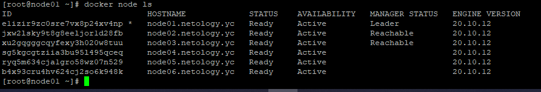
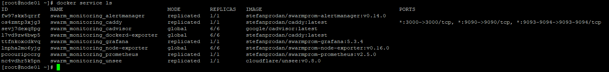

1. Ответы на вопросы:
* В чём отличие режимов работы сервисов в Docker Swarm кластере: replication и global?
  * При режиме работы `replication` - мы указываем, сколько идентичных задач хотим запустить. Например, мы решили развернуть nginx с n кол-вом реплик, тогда каждая нода будет обслуживать одну и ту же задачу.\
 При режиме работы `global` - мы запускаем одну задачу, на каждой ноде. Каждый раз, когда мы добавляем ноду в кластер, оркестратор создает задачу, а планировщик назначает задачу новой ноде.
* Какой алгоритм выбора лидера используется в Docker Swarm кластере?
  * Для выбора лидера используется алгоритм согласования `Raft`.
* Что такое Overlay Network?
  * Overlay-сеть используется в рамках swarm, где виртуальную сеть , которую используют контейнеры, связывает несколько         физических хостов, на которых запущен Docker.\
 Overlay-сеть создает подсеть, которую могут использовать контейнеры в разных хостах swarm-кластера. Контейнеры на разных физических хостах могут обмениваться данными по overlay-сети (если все они прикреплены к одной сети).\
 В работе сети используются технологии `VXLAN` и протокол `Gossip`.
2. Создали наш первый Docker Swarm кластер в Яндекс.Облаке:

3. Создали наш первый, готовый к боевой эксплуатации кластер мониторинга, состоящий из стека микросервисов:

4.Выполнили на лидере Docker Swarm кластера команду `docker swarm update --autolock=true`:
```
[root@node01 ~]# docker swarm update --autolock=true
Swarm updated.
To unlock a swarm manager after it restarts, run the `docker swarm unlock`
command and provide the following key:

    SWMKEY-1-LBDuoyaFSh6tseKcnHcRMQCj7zHGy1+LtuzO16EmuKw

Please remember to store this key in a password manager, since without it you
will not be able to restart the manager.
```
Как я понял, данная команда шифрует ключ TSL, который используется для шифрования связи между узлами swarm и так же шифрует ключ, используемый для шифрования и расшифровки журналов Raft на диске. Таким образом, при перезагрузке, нам нужно будет ввести ключ расшифровки наших ключей для успешной работы кластера.
Для себя, я провел аналогию с `ПАК СЗИ Аккорд`. У которого принцип работы такой же. Без специального ключа-пароля – работать хост успешно не будет.
