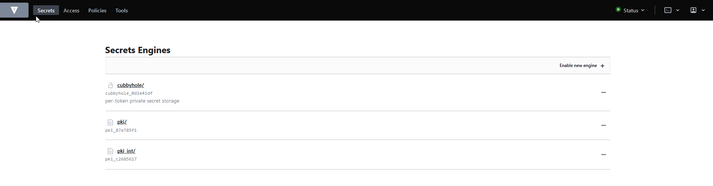
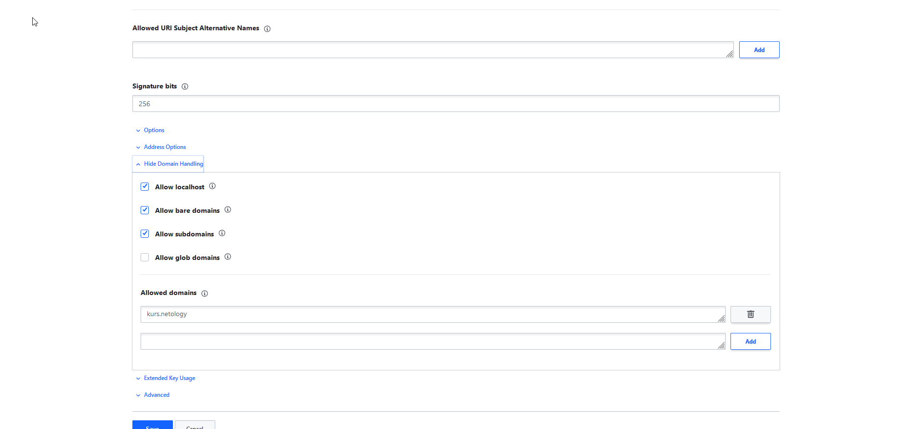
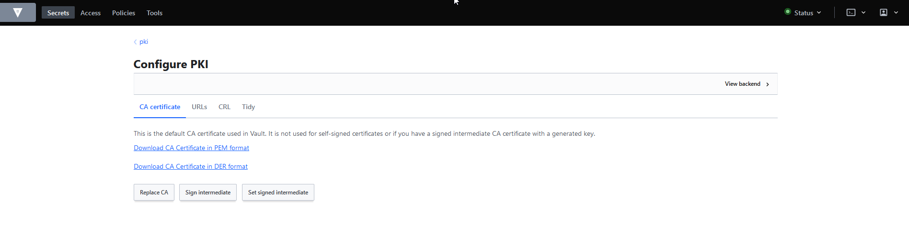
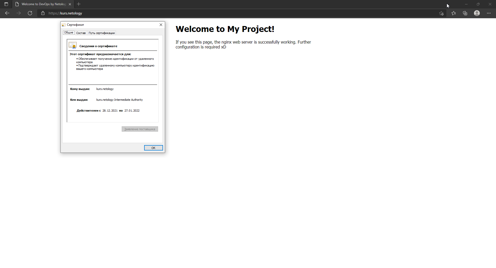
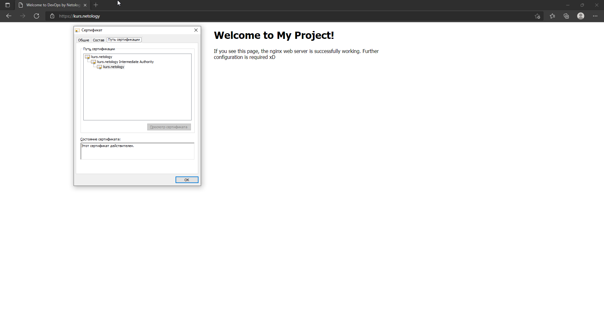
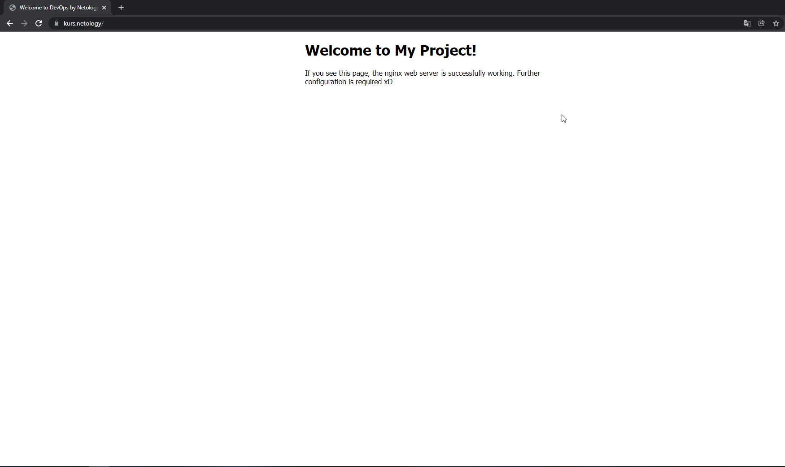
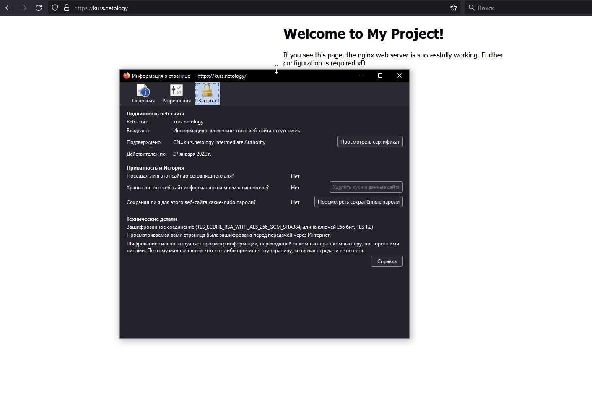
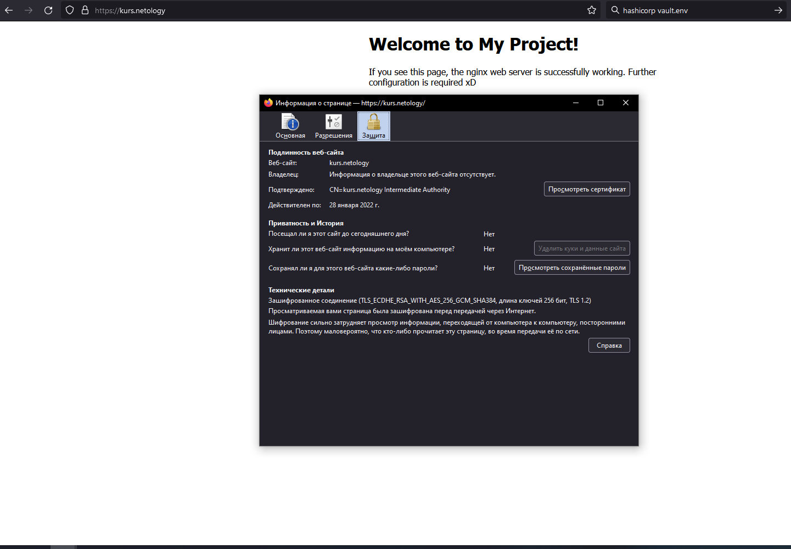

1. Создали виртуальную машину применив полученные знания, а именно с помощью vagrant. Конфиг для развертывания:
```
Vagrant.configure("2") do |config|
  config.vm.box = "bento/ubuntu-20.04"
  config.vm.define "kurs" do |kurs|
	kurs.vm.provider "vmware_desktop" do |k|
		k.gui = true
		k.vmx["memsize"] = "2048" 
		k.vmx["numvcpus"] = "2"
		k.vmx["displayname"] = "kurs"
		end
	end
end
```
Среду виртуализации все также используем VMware.

2. Установили и прописали правила для `ufw`:
```
root@vagrant:~# ufw allow 22
Rules updated
Rules updated (v6)
root@vagrant:~# ufw allow 443
Rules updated
Rules updated (v6)
root@vagrant:~# ufw allow in on lo
Rules updated
Rules updated (v6)
root@vagrant:~# ufw allow 8200
Rule added
Rule added (v6)
root@vagrant:~# ufw enable
Firewall is active and enabled on system startup
root@vagrant:~# ufw status
Status: active

To                         Action      From
--                         ------      ----
22                         ALLOW       Anywhere
443                        ALLOW       Anywhere
Anywhere on lo             ALLOW       Anywhere
8200                       ALLOW       Anywhere
22 (v6)                    ALLOW       Anywhere (v6)
443 (v6)                   ALLOW       Anywhere (v6)
Anywhere (v6) on lo        ALLOW       Anywhere (v6)
8200 (v6)                  ALLOW       Anywhere (v6)
```
Добавили дополнительно порт `8200` для доступа до Web UI.

3. Произвели установку `hashicorp vault`:
```
root@vagrant:~# curl -fsSL https://apt.releases.hashicorp.com/gpg | sudo apt-key add -
OK
root@vagrant:~# apt-add-repository "deb [arch=amd64] https://apt.releases.hashicorp.com $(lsb_release -cs) main"
Get:1 https://apt.releases.hashicorp.com focal InRelease [9,495 B]
Hit:2 http://us.archive.ubuntu.com/ubuntu focal InRelease
Get:3 http://us.archive.ubuntu.com/ubuntu focal-updates InRelease [114 kB]
Get:4 https://apt.releases.hashicorp.com focal/main amd64 Packages [41.1 kB]
Get:5 http://us.archive.ubuntu.com/ubuntu focal-backports InRelease [108 kB]
Get:6 http://us.archive.ubuntu.com/ubuntu focal-security InRelease [114 kB]
Get:7 http://us.archive.ubuntu.com/ubuntu focal-updates/main amd64 Packages [1,400 kB]
Get:8 http://us.archive.ubuntu.com/ubuntu focal-updates/main Translation-en [283 kB]
Get:9 http://us.archive.ubuntu.com/ubuntu focal-updates/restricted amd64 Packages [616 kB]
Get:10 http://us.archive.ubuntu.com/ubuntu focal-updates/restricted Translation-en [88.1 kB]
Get:11 http://us.archive.ubuntu.com/ubuntu focal-updates/universe amd64 Packages [884 kB]
Get:12 http://us.archive.ubuntu.com/ubuntu focal-updates/universe Translation-en [193 kB]
Get:13 http://us.archive.ubuntu.com/ubuntu focal-updates/multiverse amd64 Packages [24.8 kB]
Get:14 http://us.archive.ubuntu.com/ubuntu focal-updates/multiverse Translation-en [6,928 B]
Get:15 http://us.archive.ubuntu.com/ubuntu focal-backports/main amd64 Packages [42.0 kB]
Get:16 http://us.archive.ubuntu.com/ubuntu focal-backports/main Translation-en [10.0 kB]
Get:17 http://us.archive.ubuntu.com/ubuntu focal-backports/universe amd64 Packages [18.9 kB]
Get:18 http://us.archive.ubuntu.com/ubuntu focal-backports/universe Translation-en [7,492 B]
Get:19 http://us.archive.ubuntu.com/ubuntu focal-security/main amd64 Packages [1,069 kB]
Get:20 http://us.archive.ubuntu.com/ubuntu focal-security/main Translation-en [197 kB]
Get:21 http://us.archive.ubuntu.com/ubuntu focal-security/restricted amd64 Packages [566 kB]
Get:22 http://us.archive.ubuntu.com/ubuntu focal-security/restricted Translation-en [80.9 kB]
Get:23 http://us.archive.ubuntu.com/ubuntu focal-security/universe amd64 Packages [668 kB]
Get:24 http://us.archive.ubuntu.com/ubuntu focal-security/universe Translation-en [112 kB]
Get:25 http://us.archive.ubuntu.com/ubuntu focal-security/multiverse amd64 Packages [21.9 kB]
Fetched 6,674 kB in 3s (2,633 kB/s)
Reading package lists... Done
root@vagrant:~# apt-get update && sudo apt-get install vault
Hit:1 https://apt.releases.hashicorp.com focal InRelease
Hit:2 http://us.archive.ubuntu.com/ubuntu focal InRelease
Hit:3 http://us.archive.ubuntu.com/ubuntu focal-updates InRelease
Hit:4 http://us.archive.ubuntu.com/ubuntu focal-backports InRelease
Hit:5 http://us.archive.ubuntu.com/ubuntu focal-security InRelease
Reading package lists... Done
Reading package lists... Done
Building dependency tree
Reading state information... Done
The following NEW packages will be installed:
  vault
0 upgraded, 1 newly installed, 0 to remove and 45 not upgraded.
Need to get 69.4 MB of archives.
After this operation, 188 MB of additional disk space will be used.
Get:1 https://apt.releases.hashicorp.com focal/main amd64 vault amd64 1.9.2 [69.4 MB]
Fetched 69.4 MB in 2s (35.9 MB/s)
Selecting previously unselected package vault.
(Reading database ... 40208 files and directories currently installed.)
Preparing to unpack .../archives/vault_1.9.2_amd64.deb ...
Unpacking vault (1.9.2) ...
Setting up vault (1.9.2) ...
Generating Vault TLS key and self-signed certificate...
Generating a RSA private key
....................................................++++
..............................................................................................................................................++++
writing new private key to 'tls.key'
-----
Vault TLS key and self-signed certificate have been generated in '/opt/vault/tls'.
```
Немного подправили файл конфигурации ` vault.hcl`. Добавили возможность заходить в `vault` через `web ui`:
```
# Full configuration options can be found at https://www.vaultproject.io/docs/configuration

ui = true

#mlock = true
#disable_mlock = true

storage "file" {
  path = "/opt/vault/data"
}

#storage "consul" {
#  address = "127.0.0.1:8500"
#  path    = "vault"
#}

# HTTP listener
listener "tcp" {
  address = "127.0.0.1:8200"
  tls_disable = 1
}
listener "tcp" {
  address = "192.168.184.134:8200"
  tls_disable = 1
}

# HTTPS listener
#listener "tcp" {
#  address       = "0.0.0.0:8200"
#  tls_cert_file = "/opt/vault/tls/tls.crt"
#  tls_key_file  = "/opt/vault/tls/tls.key"
#}

# Enterprise license_path
# This will be required for enterprise as of v1.8
#license_path = "/etc/vault.d/vault.hclic"
```
4. Перед генерации сертификатов, инициализируем `vault`:
```
root@vagrant:/etc/vault.d# export VAULT_ADDR=http://127.0.0.1:8200
root@vagrant:/etc/vault.d# vault operator init
Unseal Key 1: jmJMYXUQZzvmgNS5NYOru+9PeHQD4NcWBFMVs7ImL+V9
Unseal Key 2: 4tmCDF92QTAaqXTH1xMb3ev/YajAKnUdLChKdfja7h2d
Unseal Key 3: rePrbWORWJuxPacfG2UTcxwWM8ZDtdtD57L+DXwxR3Qc
Unseal Key 4: eBz+Hh4yJZyor8yes3RNM5F3DxrPDavNcf5XhtHw3hr1
Unseal Key 5: Z4vataqZgYlMi3vsel6OfcPNdEQ2GNhcj+1kiwinCOZG

Initial Root Token: s.3ZJzYbSNvafMYC2W1ucV3MdH

Vault initialized with 5 key shares and a key threshold of 3. Please securely
distribute the key shares printed above. When the Vault is re-sealed,
restarted, or stopped, you must supply at least 3 of these keys to unseal it
before it can start servicing requests.

Vault does not store the generated master key. Without at least 3 keys to
reconstruct the master key, Vault will remain permanently sealed!

It is possible to generate new unseal keys, provided you have a quorum of
existing unseal keys shares. See "vault operator rekey" for more information.
root@vagrant:/etc/vault.d# vault operator unseal
root@vagrant:/etc/vault.d# vault login
root@vagrant:/etc/vault.d# vault status
Key             Value
---             -----
Seal Type       shamir
Initialized     true
Sealed          false
Total Shares    5
Threshold       3
Version         1.9.2
Storage Type    file
Cluster Name    vault-cluster-97d7f21c
Cluster ID      ff541a5c-7fd6-d4c9-9b89-9043bb359f73
HA Enabled      false
```
Начинаем генерацию корневого сертификата:
```
root@vagrant:/# vault secrets enable pki
Success! Enabled the pki secrets engine at: pki/
root@vagrant:/# vault secrets tune -max-lease-ttl=87600h pki
Success! Tuned the secrets engine at: pki/
root@vagrant:/# vault write -field=certificate pki/root/generate/internal common_name="kurs.netology" ttl=87600h > /vaultcert/CA_cert.crt
root@vagrant:/# vault write pki/config/urls issuing_certificates="$VAULT_ADDR/v1/pki/ca" crl_distribution_points="$VAULT_ADDR/v1/pki/crl"
Success! Data written to: pki/config/urls

```
Генерируем промежуточный сертификат:
```
root@vagrant:/# vault secrets enable -path=pki_int pki
Success! Enabled the pki secrets engine at: pki_int/
root@vagrant:/# vault secrets tune -max-lease-ttl=43800h pki_int
Success! Tuned the secrets engine at: pki_int/
root@vagrant:/# vault write -format=json pki_int/intermediate/generate/internal common_name="kurs.netology Intermediate Authority" | jq -r '.data.csr' > /vaultcert/pki_intermediate.csr
-bash: jq: command not found
```
Столкнулись с нехваткой одного пакета.\
Ставим вспомогательный пакет `jq` для парсинга JSON и продолжаем генерацию сертификата:
```
root@vagrant:/# apt-get install jq
```
```
root@vagrant:/# vault write -format=json pki_int/intermediate/generate/internal common_name="kurs.netology Intermediate Authority" | jq -r '.data.csr' > /vaultcert/pki_intermediate.csr
root@vagrant:/vaultcert# vault write -format=json pki/root/sign-intermediate csr=@pki_intermediate.csr format=pem_bundle ttl="43800h" | jq -r '.data.certificate' > /vaultcert/intermediate.cert.pem
root@vagrant:/vaultcert# vault write pki_int/intermediate/set-signed certificate=@intermediate.cert.pem
Success! Data written to: pki_int/intermediate/set-signed
```
Видим наши созданные сертификаты:

Производим создание ролей:
```
root@vagrant:/# vault write pki_int/roles/kurs-dot-com allowed_domains="kurs.netology" allow_subdomains=true max_ttl="720h"
Success! Data written to: pki_int/roles/kurs-dot-com
```
Создаем сразу конечный сертификат для nginx. Делаем это сразу в `json`, чтобы потом проще было его использовать:
```
vault write -format=json pki_int/issue/kurs-dot-com common_name="kurs.netology" ttl="720h" > /vaultcert/cert_nginx.json
```
Пришлось немного подправить роль, так как выполняться данная команда не хотела. Правили роль через `web ui`, а именно включили `Allow bare domains`:

5. С помощью web ui выгрузили корневой сертификат на хостовую машину и установили:



6. Произвели установку `nginx`:
```
root@vagrant:/# systemctl status nginx
● nginx.service - A high performance web server and a reverse proxy server
     Loaded: loaded (/lib/systemd/system/nginx.service; enabled; vendor preset: enabled)
     Active: active (running) since Tue 2021-12-28 15:18:10 UTC; 17s ago
       Docs: man:nginx(8)
   Main PID: 19094 (nginx)
      Tasks: 3 (limit: 2278)
     Memory: 3.6M
     CGroup: /system.slice/nginx.service
             ├─19094 nginx: master process /usr/sbin/nginx -g daemon on; master_process on;
             ├─19095 nginx: worker process
             └─19096 nginx: worker process

Dec 28 15:18:10 vagrant systemd[1]: Starting A high performance web server and a reverse proxy server...
Dec 28 15:18:10 vagrant systemd[1]: Started A high performance web server and a reverse proxy server.
```
7. Перед началом настройки `nginx` создадим каталог для нашего сайта и небольшой `html` файл:
```
root@vagrant:/var/www# mkdir -p kurs.netology/html/
root@vagrant:/var/www/kurs.netology/html# vi index.html
```
Содержимое файла `index.html`:
```
<!DOCTYPE html>
<html>
<head>
<title>Welcome to DevOps by Netology</title>
<style>
    body {
        width: 35em;
        margin: 0 auto;
        font-family: Tahoma, Verdana, Arial, sans-serif;
    }
</style>
</head>
<body>
<h1>Welcome to My Project!</h1>
<p>If you see this page, the nginx web server is successfully working. Further configuration is required xD</p>
</body>
</html>
```
Создаем конфиг для сайта:
```
root@vagrant:/etc/nginx/sites-available# vi kurs.netology
```
Содержимое файла `kurs.netology`:
```
server {
       listen 443 ssl;
       
       server_name kurs.netology;
       ssl_certificate      /etc/ssl/Nginx_certs/kurs.netology.crt;
       ssl_certificate_key /etc/ssl/Nginx_certs/kurs.netology.key;
       ssl_protocols       TLSv1 TLSv1.1 TLSv1.2;
       ssl_ciphers         HIGH:!aNULL:!MD5;

       root /var/www/kurs.netology/html;
       index index.html;

       location / {
               try_files $uri $uri/ =404;
       }
} 
```
Делаем символическую ссылку на наш файл `kurs.netology`:
```
root@vagrant:/etc/nginx/sites-available# ln -s /etc/nginx/sites-available/kurs.netology /etc/nginx/sites-enabled/kurs.netology
```
Сертификаты для `nginx` готовим с помощью `jq` для дальнейшего использования в нашем скрипте:
```
cat /vaultcert/cert_nginx.json | jq -r '.data.private_key' > /etc/ssl/Nginx_certs/kurs.netology.key
cat /vaultcert/cert_nginx.json | jq -r '.data.certificate' > /etc/ssl/Nginx_certs/kurs.netology.crt
cat /vaultcert/cert_nginx.json | jq -r '.data.ca_chain[]' >> /etc/ssl/Nginx_certs/kurs.netology.crt
```
Перезапускаем `nginx` и идем смотреть что у нас получилось.

8. Для проверки использовали несколько браузеров, а именно Microsoft Edge и Google Chrome. В Mozilla Firefox без добавления корневого сертификата в хранилище, Firefox не доверяет моему сайту, потому что издатель его сертификата неизвестен. Произвели добавление корневого сертификата.\
Проверка в `Edge`:
\
\
Проверка в `Chrome`:

Проверка в `Firefox`:

9. Для простоты работы добавили переменную окружения: 
```
root@vagrant:/# echo "export VAULT_ADDR=http://127.0.0.1:8200" >> .bashrc
```
Подготовим несколько файлов для нашего скрипта, а именно:
- Перепишем из пункта 4 ключи и Root Token для разблокировки `vault`. Для этого создадим отдельную папку, где будем хранить данные ключи и токен:
```
root@vagrant:~# mkdir /vaultkeys
```
Создаем файлы ключей и переписываем туда ключи из пункта 4:
```
root@vagrant:/vaultkeys# vi Unseal_Key_1
root@vagrant:/vaultkeys# vi Unseal_Key_2
root@vagrant:/vaultkeys# vi Unseal_Key_3
```
Cоздадим файл и для root token и перепишем из пункта 4:
```
root@vagrant:/vaultkeys# vi Root_Login_Key
```
Подготовительная часть закончена, теперь напишем небольшой скрипт `Cert_Nginx_Update.sh` для обновления сертификата:
```bash
#!/usr/bin/env bash

#Разблокируем vault
vault operator unseal $(cat /vaultkeys/Unseal_Key_1)
vault operator unseal $(cat /vaultkeys/Unseal_Key_2)
vault operator unseal $(cat /vaultkeys/Unseal_Key_3)

#Осуществляем вход под root
vault login $(cat /vaultkeys/Root_Login_Key)

#Генерируем новый сертификат
vault write -format=json pki_int/issue/kurs-dot-com common_name="kurs.netology" ttl="720h" > /vaultcert/cert_nginx.json

#Подготавливаем сертификаты для nginx
cat /vaultcert/cert_nginx.json | jq -r '.data.private_key' > /etc/ssl/Nginx_certs/kurs.netology.key
cat /vaultcert/cert_nginx.json | jq -r '.data.certificate' > /etc/ssl/Nginx_certs/kurs.netology.crt
cat /vaultcert/cert_nginx.json | jq -r '.data.ca_chain[]' >> /etc/ssl/Nginx_certs/kurs.netology.crt

#Перезагружаем конфиг nginx
systemctl reload nginx
```
Зашли на наш сайт и проверили сертификат. Сертификат изменился, значит наш скрипт успешно отработал.\

10. Поместим его теперь в `crontab`. Запускаться у нас скрипт будет каждый месяц 1 числа в 1:00 :
```bash
0 1 1 * * /root/Scripts/Cert_Nginx_Update.sh
```
